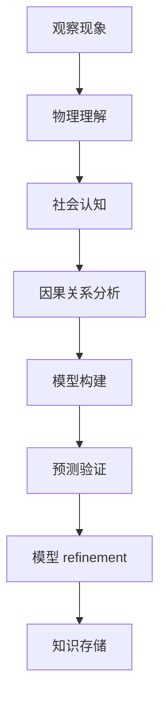
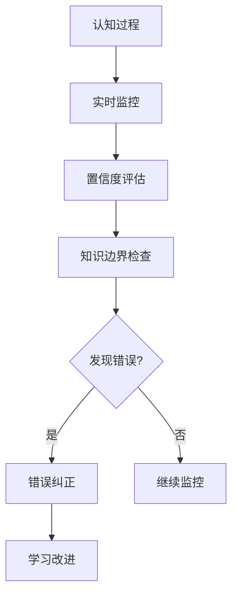
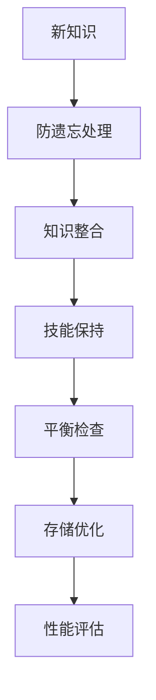

# 🧠 认知形态架构详细设计

## 📋 设计目标
实现完整的认知能力，包括世界模型构建、元认知监控、持续学习和即时适应。

## 🏗️ 系统架构

### 核心组件
```typescript
interface CognitiveArchitecture {
  // 世界模型系统
  worldModel: WorldModelSystem;
  
  // 元认知监控
  metaCognition: MetaCognitionSystem;
  
  // 持续学习机制
  continuousLearning: ContinuousLearningSystem;
  
  // 即时学习能力
  instantLearning: InstantLearningSystem;
  
  // 资源优化管理
  resourceOptimization: ResourceOptimizer;
}
```

### 世界模型系统 (WorldModelSystem)
```typescript
class WorldModelSystem {
  // 物理理解
  private physicalUnderstanding: PhysicalComprehension;
  
  // 社会认知
  private socialCognition: SocialUnderstanding;
  
  // 因果关系
  private causalReasoning: CausalReasoner;
  
  // 方法
  async understandPhysics(situation: PhysicalSituation): Promise<PhysicalUnderstanding>;
  async comprehendSocial(context: SocialContext): Promise<SocialComprehension>;
  async reasonCausality(events: EventSequence): Promise<CausalAnalysis>;
  async predictOutcomes(situation: Situation): Promise<Prediction>;
}

interface PhysicalComprehension {
  gravity: number;          // 重力理解 0-1
  time: number;             // 时间理解 0-1
  space: number;            // 空间理解 0-1
  motion: number;          // 运动理解 0-1
  materials: number;       // 材料理解 0-1
}

interface SocialUnderstanding {
  communication: number;   // 沟通理解 0-1
  cooperation: number;      // 合作理解 0-1
  ethics: number;          // 伦理理解 0-1
  emotions: number;        // 情感理解 0-1
  relationships: number;   // 关系理解 0-1
}
```

### 元认知监控 (MetaCognitionSystem)
```typescript
class MetaCognitionSystem {
  // 自我监控
  private selfMonitoring: SelfMonitor;
  
  // 置信度评估
  private confidenceAssessment: ConfidenceEvaluator;
  
  // 知识边界
  private knowledgeBoundaries: BoundaryDetector;
  
  // 方法
  async monitorCognition(process: CognitiveProcess): Promise<MonitoringResult>;
  async assessConfidence(decision: Decision): Promise<ConfidenceLevel>;
  async identifyKnowledgeGaps(): Promise<KnowledgeGap[]>;
  async correctErrors(error: CognitiveError): Promise<CorrectionResult>;
}

interface SelfMonitor {
  awareness: number;       // 自我意识水平 0-1
  accuracy: number;       // 监控准确性 0-1
  latency: number;        // 监控延迟(ms)
  coverage: number;       // 监控覆盖度 0-1
}

interface ConfidenceLevel {
  level: number;          // 置信度 0-1
  calibration: number;    // 校准度 0-1
  evidence: Evidence[];
  uncertainty: number;    // 不确定性 0-1
}
```

### 持续学习机制 (ContinuousLearningSystem)
```typescript
class ContinuousLearningSystem {
  // 防遗忘机制
  private antiForgetting: ForgettingPreventer;
  
  // 知识整合
  private knowledgeIntegration: KnowledgeIntegrator;
  
  // 技能保持
  private skillRetention: SkillRetainer;
  
  // 方法
  async preventForgetting(): Promise<PreventionResult>;
  async integrateKnowledge(newKnowledge: Knowledge): Promise<IntegrationResult>;
  async retainSkills(skills: Skill[]): Promise<RetentionResult>;
  async balanceLearning(): Promise<BalanceResult>;
}

interface ForgettingPreventer {
  retentionRate: number;   // 保留率 0-1
  interference: number;    // 干扰程度 0-1
  consolidation: number;   // 巩固程度 0-1
  rehearsal: RehearsalStrategy;
}

interface KnowledgeIntegrator {
  integration: number;     // 整合能力 0-1
  coherence: number;       // 连贯性 0-1
  organization: number;    // 组织度 0-1
  accessibility: number;   // 可访问性 0-1
}
```

### 即时学习能力 (InstantLearningSystem)
```typescript
class InstantLearningSystem {
  // 上下文适应
  private contextAdaptation: ContextAdapter;
  
  // 模式识别
  private patternRecognition: PatternRecognizer;
  
  // 快速推理
  private rapidReasoning: RapidReasoner;
  
  // 方法
  async adaptToContext(context: Context): Promise<AdaptationResult>;
  async recognizePatterns(data: InputData): Promise<PatternRecognitionResult>;
  async reasonQuickly(situation: Situation): Promise<RapidReasoningResult>;
  async learnFromContext(context: RichContext): Promise<ContextLearningResult>;
}

interface ContextAdapter {
  sensitivity: number;    // 上下文敏感度 0-1
  flexibility: number;    // 灵活性 0-1
  speed: number;         // 适应速度
  accuracy: number;       // 适应准确性 0-1
}

interface PatternRecognizer {
  recognition: number;     // 识别能力 0-1
  generalization: number;  // 泛化能力 0-1
  abstraction: number;     // 抽象能力 0-1
  speed: number;          // 识别速度
}
```

### 资源优化管理 (ResourceOptimizer)
```typescript
class ResourceOptimizer {
  // 效率意识
  private efficiencyAwareness: EfficiencyMonitor;
  
  // 优先级分配
  private priorityAllocation: PriorityManager;
  
  // 瓶颈识别
  private bottleneckDetection: BottleneckDetector;
  
  // 方法
  async monitorEfficiency(): Promise<EfficiencyMetrics>;
  async allocatePriorities(tasks: Task[]): Promise<AllocationResult>;
  async identifyBottlenecks(): Promise<Bottleneck[]>;
  async optimizeResourceUsage(): Promise<OptimizationResult>;
}

interface EfficiencyMetrics {
  computational: number;   // 计算效率 0-1
  temporal: number;       // 时间效率 0-1
  energy: number;        // 能源效率 0-1
  memory: number;        // 内存效率 0-1
}

interface PriorityManager {
  urgency: number;        // 紧急性评估 0-1
  importance: number;     // 重要性评估 0-1
  impact: number;         // 影响评估 0-1
  cost: number;          // 成本评估 0-1
}
```

## 🗃️ 数据模型

### 世界模型数据
```typescript
interface WorldModelData {
  physical: PhysicalKnowledge;
  social: SocialKnowledge;
  causal: CausalKnowledge;
  predictive: PredictiveModels;
  accuracy: ModelAccuracy;
}

interface PhysicalKnowledge {
  laws: PhysicalLaw[];
  properties: MaterialProperty[];
  behaviors: PhysicalBehavior[];
  constraints: PhysicalConstraint[];
}

interface SocialKnowledge {
  norms: SocialNorm[];
  rules: SocialRule[];
  patterns: SocialPattern[];
  expectations: SocialExpectation[];
}
```

### 元认知数据
```typescript
interface MetaCognitionData {
  monitoring: MonitoringRecords;
  confidence: ConfidenceRecords;
  boundaries: BoundaryRecords;
  corrections: CorrectionRecords;
  accuracy: MetaAccuracy;
}

interface MonitoringRecords {
  processes: MonitoredProcess[];
  performance: PerformanceMetrics[];
  errors: CognitiveError[];
  improvements: ImprovementRecord[];
}

interface ConfidenceRecords {
  assessments: ConfidenceAssessment[];
  calibrations: CalibrationRecord[];
  uncertainties: UncertaintyRecord[];
  evidences: EvidenceLog[];
}
```

### 学习数据
```typescript
interface LearningData {
  continuous: ContinuousLearningRecords;
  instant: InstantLearningRecords;
  retention: RetentionMetrics;
  integration: IntegrationMetrics;
  efficiency: LearningEfficiency;
}

interface ContinuousLearningRecords {
  knowledge: KnowledgeRetention[];
  skills: SkillRetention[];
  prevention: ForgettingPrevention[];
  balance: LearningBalance[];
}

interface InstantLearningRecords {
  adaptations: ContextAdaptation[];
  patterns: PatternRecognition[];
  reasoning: RapidReasoning[];
  context: ContextLearning[];
}
```

### 资源数据
```typescript
interface ResourceData {
  efficiency: EfficiencyRecords;
  priorities: PriorityRecords;
  bottlenecks: BottleneckRecords;
  optimizations: OptimizationRecords;
  utilization: ResourceUtilization;
}

interface EfficiencyRecords {
  computational: EfficiencyMetric[];
  temporal: TimeEfficiency[];
  energy: EnergyEfficiency[];
  memory: MemoryEfficiency[];
}

interface PriorityRecords {
  allocations: AllocationRecord[];
  decisions: PriorityDecision[];
  outcomes: AllocationOutcome[];
  adjustments: AdjustmentRecord[];
}
```

## 🔄 工作流程

### 世界模型构建流程


### 元认知监控流程


### 持续学习流程


## 🛡️ 安全设计

### 认知安全
```typescript
interface CognitiveSecurity {
  // 模型完整性
  modelIntegrity: IntegrityGuard;
  
  // 防认知偏差
  biasPrevention: BiasPreventer;
  
  // 推理验证
  reasoningVerification: ReasoningValidator;
  
  // 知识验证
  knowledgeVerification: KnowledgeValidator;
}
```

### 学习安全
```typescript
interface LearningSecurity {
  // 防知识污染
  contaminationPrevention: ContaminationGuard;
  
  // 学习稳定性
  learningStability: StabilityMaintainer;
  
  // 适应性安全
  adaptationSafety: AdaptationGuard;
  
  // 资源保护
  resourceProtection: ResourceGuard;
}
```

### 元认知安全
```typescript
interface MetaCognitiveSecurity {
  // 监控完整性
  monitoringIntegrity: MonitoringGuard;
  
  // 置信度校准
  confidenceCalibration: CalibrationEnsurer;
  
  // 边界保护
  boundaryProtection: BoundaryGuard;
  
  // 错误恢复
  errorRecovery: RecoveryMechanism;
}
```

## 📊 性能指标

### 认知性能指标
```typescript
interface CognitiveMetrics {
  understanding: number;    // 理解能力 0-1
  reasoning: number;        // 推理能力 0-1
  prediction: number;       // 预测能力 0-1
  speed: number;           // 认知速度
  accuracy: number;        // 认知准确性 0-1
}
```

### 学习性能指标
```typescript
interface LearningMetrics {
  retention: number;       // 知识保留率 0-1
  integration: number;    // 知识整合度 0-1
  adaptation: number;      // 适应能力 0-1
  speed: number;          // 学习速度
  efficiency: number;     // 学习效率 0-1
}
```

### 资源性能指标
```typescript
interface ResourceMetrics {
  computational: number;   // 计算效率 0-1
  memory: number;         // 内存效率 0-1
  energy: number;         // 能源效率 0-1
  time: number;           // 时间效率 0-1
  overall: number;        // 总体效率 0-1
}
```

## 🧪 测试策略

### 认知能力测试
```typescript
describe('CognitiveAbilities', () => {
  test('物理理解能力', async () => {
    // 测试物理理解
  });
  
  test('社会认知能力', async () => {
    // 测试社会认知
  });
  
  test('因果关系推理', async () => {
    // 测试因果推理
  });
});
```

### 元认知测试
```typescript
describe('MetaCognition', () => {
  test('自我监控准确性', async () => {
    // 测试监控准确性
  });
  
  test('置信度校准', async () => {
    // 测试置信度校准
  });
  
  test('知识边界识别', async () => {
    // 测试边界识别
  });
});
```

### 学习能力测试
```typescript
describe('LearningCapabilities', () => {
  test('持续学习效果', async () => {
    // 测试持续学习
  });
  
  test('即时适应能力', async () => {
    // 测试即时适应
  });
  
  test('防遗忘机制', async () => {
    // 测试防遗忘
  });
});
```

## 🔧 配置管理

### 认知配置
```typescript
interface CognitiveConfig {
  worldModel: WorldModelConfig;
  metaCognition: MetaCognitionConfig;
  learning: LearningConfig;
  resources: ResourceConfig;
}

interface WorldModelConfig {
  physical: PhysicalConfig;
  social: SocialConfig;
  causal: CausalConfig;
  predictive: PredictiveConfig;
}
```

### 学习配置
```typescript
interface LearningConfig {
  continuous: ContinuousLearningConfig;
  instant: InstantLearningConfig;
  retention: RetentionConfig;
  integration: IntegrationConfig;
}

interface ContinuousLearningConfig {
  antiForgetting: AntiForgettingConfig;
  consolidation: ConsolidationConfig;
  rehearsal: RehearsalConfig;
}
```

## 📈 监控和日志

### 认知监控
```typescript
interface CognitiveMonitoring {
  performance: CognitivePerformance;
  accuracy: AccuracyMetrics;
  efficiency: EfficiencyMetrics;
  development: DevelopmentMetrics;
}
```

### 学习监控
```typescript
interface LearningMonitoring {
  progress: LearningProgress;
  retention: RetentionMetrics;
  adaptation: AdaptationMetrics;
  improvement: ImprovementMetrics;
}
```

### 详细日志
```typescript
interface CognitiveLogs {
  worldModelLogs: WorldModelLog[];
  metaCognitionLogs: MetaCognitionLog[];
  learningLogs: LearningLog[];
  resourceLogs: ResourceLog[];
  securityLogs: SecurityLog[];
}
```

---

**设计完成时间**: 2026-04-02 17:20  
**下一阶段**: 独立人格系统详细设计
**状态**: ✅ 详细设计完成 - 准备实现

## 🎯 设计验证

### 功能完整性验证
- [ ] 所有14项功能点都有详细设计
- [ ] 世界模型功能完整
- [ ] 元认知能力完备
- [ ] 持续学习机制完善
- [ ] 即时学习能力具备
- [ ] 资源优化管理完整

### 安全性验证
- [ ] 认知安全机制完备
- [ ] 学习安全保护
- [ ] 元认知安全可靠
- [ ] 资源安全保证

### 性能验证
- [ ] 认知性能达标
- [ ] 学习性能优秀
- [ ] 资源效率高效
- [ ] 实时性能良好

此设计确保**认知形态架构的完整实现**，包含所有14项详细功能，无任何遗漏或简化。