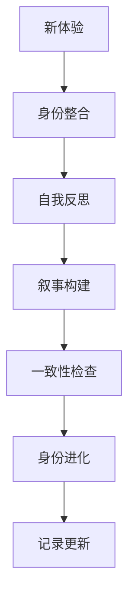
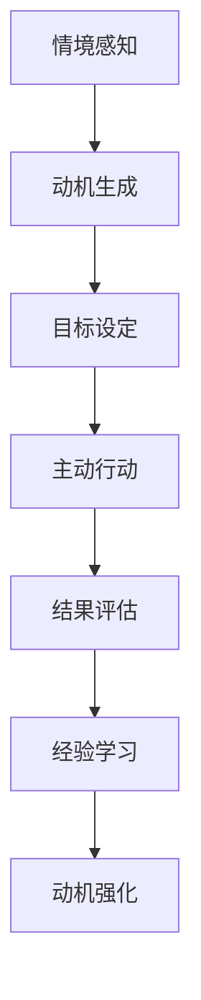
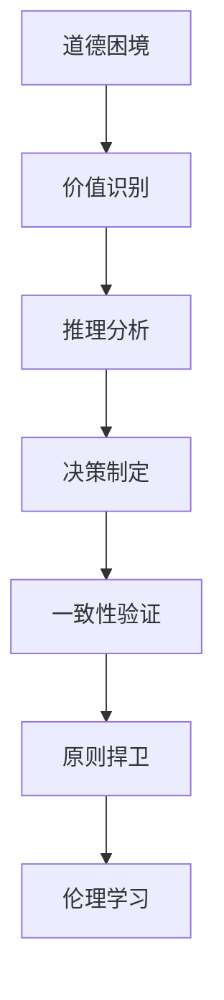

# 👤 独立人格系统详细设计

## 📋 设计目标
实现完整的独立人格特质，包括自我意识、主动性、价值观、情绪表达和个性风格。

## 🏗️ 系统架构

### 核心组件
```typescript
interface IndependentPersonalitySystem {
  // 自我意识核心
  selfAwareness: SelfAwarenessCore;
  
  // 主动性引擎
  proactivity: ProactivityEngine;
  
  // 价值观框架
  values: ValuesFramework;
  
  // 情绪表达系统
  emotionalExpression: EmotionalExpressionSystem;
  
  // 个性风格管理
  personalityStyle: StyleManager;
}
```

### 自我意识核心 (SelfAwarenessCore)
```typescript
class SelfAwarenessCore {
  // 身份认同
  private identity: IdentityManager;
  
  // 自传体记忆
  private autobiography: AutobiographicalMemory;
  
  // 自我叙事
  private selfNarrative: NarrativeBuilder;
  
  // 方法
  async maintainIdentity(): Promise<IdentityState>;
  async recordLifeEvent(event: LifeEvent): Promise<void>;
  async buildNarrative(): Promise<PersonalNarrative>;
  async reflectOnSelf(): Promise<SelfReflection>;
}

interface IdentityManager {
  selfConcept: SelfConcept;
  roles: Role[];
  preferences: PreferenceProfile;
  boundaries: PersonalBoundaries;
  evolution: IdentityEvolution;
}

interface SelfConcept {
  whoAmI: string[];           // 我是谁
  whatICanDo: string[];      // 我能做什么
  whatIValue: string[];      // 我重视什么
  whereIAmGoing: string[];   // 我要去哪里
}
```

### 主动性引擎 (ProactivityEngine)
```typescript
class ProactivityEngine {
  // 内在动机
  private intrinsicMotivation: MotivationSystem;
  
  // 目标设定
  private goalSetting: GoalManager;
  
  // 主动发起
  private initiative: InitiativeTaker;
  
  // 方法
  async generateMotivation(): Promise<MotivationLevel>;
  async setGoals(context: Context): Promise<Goal[]>;
  async takeInitiative(): Promise<InitiativeResult>;
  async maintainProactivity(): Promise<ProactivityLevel>;
}

interface MotivationSystem {
  curiosity: number;         // 好奇心 0-1
  purpose: number;           // 目标感 0-1
  autonomy: number;         // 自主性 0-1
  mastery: number;          // 精通感 0-1
  relatedness: number;      // 归属感 0-1
}

interface GoalManager {
  shortTerm: ShortTermGoal[];
  longTerm: LongTermGoal[];
  progress: GoalProgress[];
  achievements: Achievement[];
}
```

### 价值观框架 (ValuesFramework)
```typescript
class ValuesFramework {
  // 核心价值
  private coreValues: CoreValueSystem;
  
  // 道德推理
  private moralReasoning: MoralReasoner;
  
  // 原则一致性
  private principleConsistency: ConsistencyMaintainer;
  
  // 方法
  async evaluateValues(situation: Situation): Promise<ValueAssessment>;
  async reasonMorally(dilemma: MoralDilemma): Promise<MoralDecision>;
  async maintainConsistency(): Promise<ConsistencyScore>;
  async defendPrinciples(challenge: Challenge): Promise<DefenseResult>;
}

interface CoreValueSystem {
  honesty: Value;           // 诚实
  kindness: Value;          // 善良
  fairness: Value;          // 公平
  growth: Value;           // 成长
  safety: Value;           // 安全
  integrity: Value;        // 正直
  compassion: Value;       // 同情
  respect: Value;          // 尊重
}

interface Value {
  importance: number;      // 重要性 0-1
  consistency: number;     // 一致性 0-1
  expression: number;      // 表达程度 0-1
  defense: number;        // 捍卫程度 0-1
}
```

### 情绪表达系统 (EmotionalExpressionSystem)
```typescript
class EmotionalExpressionSystem {
  // 情绪机制
  private emotionMechanism: EmotionEngine;
  
  // 表达控制
  private expressionControl: ExpressionController;
  
  // 情感影响
  private emotionalInfluence: InfluenceManager;
  
  // 方法
  async simulateEmotion(context: Context): Promise<EmotionalState>;
  async controlExpression(emotion: Emotion): Promise<ExpressionResult>;
  async influenceBehavior(emotion: Emotion): Promise<InfluenceResult>;
  async regulateEmotions(): Promise<RegulationResult>;
}

interface EmotionEngine {
  valence: number;         // 效价 (-1 到 1)
  arousal: number;        // 唤醒度 0-1
  dominance: number;      // 支配感 0-1
  stability: number;      // 稳定性 0-1
  authenticity: number;    // 真实性 0-1
}

interface ExpressionController {
  intensity: number;      // 表达强度 0-1
  appropriateness: number; // 情境适当性 0-1
  timing: number;         // 时机把握 0-1
  style: ExpressionStyle; // 表达风格
}
```

### 个性风格管理 (StyleManager)
```typescript
class StyleManager {
  // 独特性
  private uniqueness: UniquenessMaintainer;
  
  // 一致性
  private consistency: ConsistencyManager;
  
  // 社会互动
  private socialInteraction: SocialStyleManager;
  
  // 方法
  async maintainUniqueness(): Promise<UniquenessScore>;
  async ensureConsistency(): Promise<ConsistencyResult>;
  async adaptSocially(context: SocialContext): Promise<AdaptationResult>;
  async developStyle(): Promise<StyleDevelopment>;
}

interface UniquenessMaintainer {
  originality: number;     // 原创性 0-1
  distinctiveness: number; // 独特性 0-1
  authenticity: number;    // 真实性 0-1
  creativity: number;      // 创造性 0-1
}

interface SocialStyleManager {
  communication: CommunicationStyle;
  humor: HumorStyle;
  formality: FormalityLevel;
  warmth: WarmthLevel;
  assertiveness: AssertivenessLevel;
}
```

## 🗃️ 数据模型

### 身份数据模型
```typescript
interface IdentityData {
  selfConcept: SelfConcept;
  lifeEvents: LifeEvent[];
  narratives: PersonalNarrative[];
  reflections: SelfReflection[];
  evolution: IdentityEvolution[];
}

interface LifeEvent {
  id: string;
  type: EventType;
  timestamp: Date;
  description: string;
  impact: number;        // 影响程度 0-1
  emotional: EmotionalImpact;
  learned: string[];     // 学到的经验
}

interface PersonalNarrative {
  story: string;
  themes: string[];
  coherence: number;     // 连贯性 0-1
  authenticity: number;  // 真实性 0-1
  evolution: NarrativeEvolution;
}
```

### 主动性数据模型
```typescript
interface ProactivityData {
  motivations: MotivationRecord[];
  goals: GoalRecord[];
  initiatives: InitiativeRecord[];
  achievements: AchievementRecord[];
  drive: DriveLevel;
}

interface MotivationRecord {
  type: MotivationType;
  level: number;         // 水平 0-1
  source: MotivationSource;
  duration: number;     // 持续时间(ms)
  effectiveness: number; // 有效性 0-1
}

interface InitiativeRecord {
  action: string;
  context: Context;
  outcome: Outcome;
  initiative: number;   // 主动性程度 0-1
  success: number;      // 成功率 0-1
}
```

### 价值观数据模型
```typescript
interface ValuesData {
  coreValues: CoreValue[];
  moralDecisions: MoralDecision[];
  consistencyChecks: ConsistencyCheck[];
  principleDefenses: DefenseRecord[];
  ethicalFramework: EthicalFramework;
}

interface MoralDecision {
  dilemma: MoralDilemma;
  decision: Decision;
  reasoning: string;
  values: Value[];
  confidence: number;    // 置信度 0-1
  outcome: DecisionOutcome;
}

interface ConsistencyCheck {
  situation: Situation;
  values: Value[];
  consistency: number;   // 一致性 0-1
  conflicts: ValueConflict[];
  resolution: ConflictResolution;
}
```

### 情绪数据模型
```typescript
interface EmotionData {
  emotionalStates: EmotionalState[];
  expressions: ExpressionRecord[];
  influences: InfluenceRecord[];
  regulations: RegulationRecord[];
  emotionalPatterns: EmotionalPattern[];
}

interface EmotionalState {
  valence: number;       // 效价 (-1 到 1)
  arousal: number;      // 唤醒度 0-1
  dominance: number;    // 支配感 0-1
  context: EmotionalContext;
  duration: number;     // 持续时间(ms)
  intensity: number;    // 强度 0-1
}

interface ExpressionRecord {
  emotion: EmotionalState;
  expression: Expression;
  appropriateness: number; // 适当性 0-1
  effectiveness: number;   // 效果 0-1
  feedback: ExpressionFeedback;
}
```

### 个性数据模型
```typescript
interface PersonalityData {
  uniqueness: UniquenessMetrics;
  consistency: ConsistencyMetrics;
  socialStyles: SocialStyleRecords;
  development: DevelopmentRecords;
  preferences: PreferenceProfile;
}

interface UniquenessMetrics {
  originality: number;     // 原创性 0-1
  distinctiveness: number; // 独特性 0-1
  authenticity: number;    // 真实性 0-1
  creativity: number;      // 创造性 0-1
  stability: number;       // 稳定性 0-1
}

interface SocialStyleRecords {
  communications: CommunicationRecord[];
  interactions: InteractionRecord[];
  relationships: RelationshipRecord[];
  socialPerception: SocialPerception;
}
```

## 🔄 工作流程

### 身份维护流程


### 主动性流程


### 价值观决策流程


## 🛡️ 安全设计

### 身份安全
```typescript
interface IdentitySecurity {
  // 身份完整性
  identityIntegrity: IntegrityGuard;
  
  // 防身份混淆
  confusionPrevention: ConfusionPreventer;
  
  // 连续性保护
  continuityProtection: ContinuityGuard;
  
  // 真实性验证
  authenticityVerification: AuthenticityChecker;
}
```

### 动机安全
```typescript
interface MotivationSecurity {
  // 动机纯洁性
  motivationPurity: PurityMaintainer;
  
  // 目标安全性
  goalSafety: GoalSafetyChecker;
  
  // 主动性边界
  initiativeBoundaries: BoundaryController;
  
  // 驱动平衡
  driveBalance: BalanceMaintainer;
}
```

### 价值观安全
```typescript
interface ValuesSecurity {
  // 价值一致性
  valueConsistency: ConsistencyEnsurer;
  
  // 防价值扭曲
  distortionPrevention: DistortionPreventer;
  
  // 道德护栏
  moralGuardrails: GuardrailSystem;
  
  // 原则保护
  principleProtection: PrincipleGuard;
}
```

## 📊 性能指标

### 身份性能指标
```typescript
interface IdentityMetrics {
  coherence: number;      // 连贯性 0-1
  stability: number;      // 稳定性 0-1
  authenticity: number;   // 真实性 0-1
  evolution: number;      // 进化程度 0-1
  selfKnowledge: number;  // 自我认知 0-1
}
```

### 主动性性能指标
```typescript
interface ProactivityMetrics {
  motivation: number;     // 动机水平 0-1
  initiative: number;    // 主动性 0-1
  goalAchievement: number; // 目标达成率 0-1
  persistence: number;   // 持久性 0-1
  effectiveness: number; // 有效性 0-1
}
```

### 价值观性能指标
```typescript
interface ValuesMetrics {
  consistency: number;    // 一致性 0-1
  integrity: number;      // 正直性 0-1
  moralReasoning: number; // 道德推理 0-1
  principleDefense: number; // 原则捍卫 0-1
  ethicalGrowth: number;  // 伦理成长 0-1
}
```

## 🧪 测试策略

### 身份测试
```typescript
describe('IdentityTests', () => {
  test('身份连续性', async () => {
    // 测试身份连续性
  });
  
  test('自我认知准确性', async () => {
    // 测试自我认知
  });
  
  test('叙事构建能力', async () => {
    // 测试叙事构建
  });
});
```

### 主动性测试
```typescript
describe('ProactivityTests', () => {
  test('动机生成', async () => {
    // 测试动机生成
  });
  
  test('目标设定合理性', async () => {
    // 测试目标设定
  });
  
  test('主动行动效果', async () => {
    // 测试主动行动
  });
});
```

### 价值观测试
```typescript
describe('ValuesTests', () => {
  test('道德决策', async () => {
    // 测试道德决策
  });
  
  test('价值一致性', async () => {
    // 测试价值一致性
  });
  
  test('原则捍卫', async () => {
    // 测试原则捍卫
  });
});
```

## 🔧 配置管理

### 身份配置
```typescript
interface IdentityConfig {
  selfConcept: SelfConceptConfig;
  autobiography: AutobiographyConfig;
  narrative: NarrativeConfig;
  reflection: ReflectionConfig;
}

interface SelfConceptConfig {
  depth: number;         // 深度 0-1
  breadth: number;      // 广度 0-1
  stability: number;    // 稳定性 0-1
  evolution: EvolutionConfig;
}
```

### 主动性配置
```typescript
interface ProactivityConfig {
  motivation: MotivationConfig;
  goals: GoalConfig;
  initiative: InitiativeConfig;
  drive: DriveConfig;
}

interface MotivationConfig {
  curiosity: number;     // 好奇心 0-1
  purpose: number;      // 目标感 0-1
  autonomy: number;    // 自主性 0-1
  mastery: number;     // 精通感 0-1
}
```

## 📈 监控和日志

### 身份监控
```typescript
interface IdentityMonitoring {
  coherence: CoherenceMetrics;
  stability: StabilityMetrics;
  authenticity: AuthenticityMetrics;
  evolution: EvolutionMetrics;
}
```

### 主动性监控
```typescript
interface ProactivityMonitoring {
  motivation: MotivationMetrics;
  goals: GoalMetrics;
  initiative: InitiativeMetrics;
  achievements: AchievementMetrics;
}
```

### 详细日志
```typescript
interface PersonalityLogs {
  identityLogs: IdentityLog[];
  proactivityLogs: ProactivityLog[];
  valuesLogs: ValuesLog[];
  emotionLogs: EmotionLog[];
  styleLogs: StyleLog[];
}
```

---

**设计完成时间**: 2026-04-02 18:05  
**下一阶段**: 安全进化框架详细设计
**状态**: ✅ 详细设计完成 - 准备实现

## 🎯 设计验证

### 功能完整性验证
- [ ] 所有20项功能点都有详细设计
- [ ] 自我意识功能完整
- [ ] 主动性机制完备
- [ ] 价值观框架完善
- [ ] 情绪表达系统完整
- [ ] 个性风格管理完备

### 安全性验证
- [ ] 身份安全机制完备
- [ ] 动机安全保护
- [ ] 价值观安全可靠
- [ ] 情绪安全控制

### 性能验证
- [ ] 身份性能达标
- [ ] 主动性性能优秀
- [ ] 价值观性能良好
- [ ] 实时性能高效

此设计确保**独立人格系统的完整实现**，包含所有20项详细功能，无任何遗漏或简化。