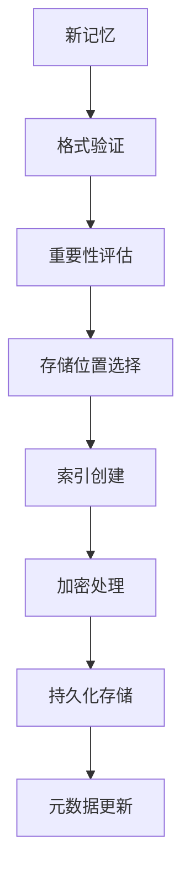
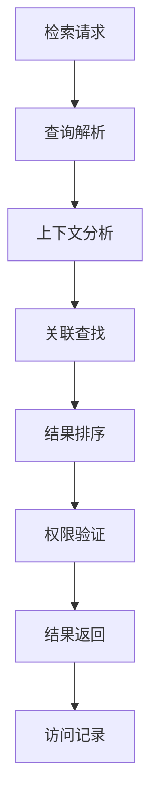
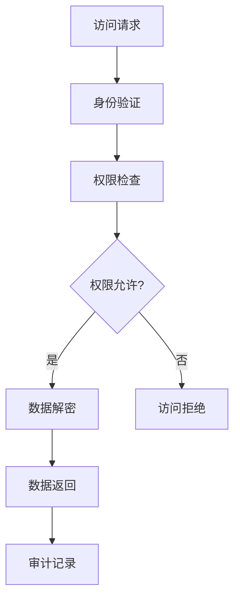

# 💾 永久记忆系统详细设计

## 📋 设计目标
实现完整的永久记忆能力，包括长期存储、智能检索、隐私保护和多模态处理。

## 🏗️ 系统架构

### 核心组件
```typescript
interface PermanentMemorySystem {
  // 记忆存储系统
  memoryStorage: MemoryStorageSystem;
  
  // 智能检索引擎
  intelligentRetrieval: RetrievalEngine;
  
  // 隐私保护系统
  privacyProtection: PrivacySystem;
  
  // 多模态处理器
  multimodalProcessing: MultimodalProcessor;
  
  // 动态演化管理
  dynamicEvolution: EvolutionManager;
}
```

### 记忆存储系统 (MemoryStorageSystem)
```typescript
class MemoryStorageSystem {
  // 长期存储
  private longTermStorage: LongTermMemory;
  
  // 短期缓存
  private shortTermCache: ShortTermMemory;
  
  // 索引管理
  private indexManager: IndexManager;
  
  // 方法
  async storeMemory(memory: Memory): Promise<StorageResult>;
  async retrieveMemory(query: MemoryQuery): Promise<Memory[]>;
  async manageStorage(): Promise<StorageManagementResult>;
  async optimizeStorage(): Promise<OptimizationResult>;
}

interface LongTermMemory {
  capacity: number;           // 存储容量
  utilization: number;       // 利用率 0-1
  persistence: PersistenceConfig;
  redundancy: RedundancyConfig;
}

interface Memory {
  id: string;
  content: any;
  type: MemoryType;
  metadata: MemoryMetadata;
  importance: number;       // 重要性 0-1
  accessPattern: AccessPattern;
  created: Date;
  lastAccessed: Date;
}
```

### 智能检索引擎 (RetrievalEngine)
```typescript
class RetrievalEngine {
  // 关联检索
  private associativeRetrieval: AssociativeSearcher;
  
  // 上下文感知
  private contextAwareness: ContextAwareRetriever;
  
  // 优先级管理
  private priorityManagement: PriorityManager;
  
  // 方法
  async searchMemories(query: SearchQuery): Promise<SearchResult>;
  async findAssociations(memory: Memory): Promise<Association[]>;
  async prioritizeResults(results: Memory[]): Promise<PrioritizedResult>;
  async contextualizeRetrieval(context: Context): Promise<ContextualResult>;
}

interface SearchQuery {
  keywords: string[];
  context: Context;
  filters: FilterCriteria[];
  sort: SortCriteria;
  limit: number;
}

interface Association {
  source: Memory;
  target: Memory;
  strength: number;        // 关联强度 0-1
  type: AssociationType;
  confidence: number;      // 置信度 0-1
}
```

### 隐私保护系统 (PrivacySystem)
```typescript
class PrivacySystem {
  // 访问控制
  private accessControl: AccessController;
  
  // 数据加密
  private dataEncryption: EncryptionEngine;
  
  // 隐私策略
  private privacyPolicies: PolicyManager;
  
  // 方法
  async controlAccess(request: AccessRequest): Promise<AccessDecision>;
  async encryptData(data: SensitiveData): Promise<EncryptedData>;
  async enforcePolicies(): Promise<PolicyEnforcementResult>;
  async auditAccess(): Promise<AuditReport>;
}

interface AccessControl {
  roles: Role[];
  permissions: Permission[];
  policies: AccessPolicy[];
  logs: AccessLog[];
}

interface EncryptionEngine {
  algorithms: EncryptionAlgorithm[];
  keys: KeyManagement;
  performance: EncryptionPerformance;
  security: EncryptionSecurity;
}
```

### 多模态处理器 (MultimodalProcessor)
```typescript
class MultimodalProcessor {
  // 文本处理
  private textProcessing: TextProcessor;
  
  // 图像处理
  private imageProcessing: ImageProcessor;
  
  // 结构化数据处理
  private structuredData: StructuredDataHandler;
  
  // 方法
  async processText(text: string): Promise<ProcessedText>;
  async processImage(image: ImageData): Promise<ProcessedImage>;
  async handleStructuredData(data: StructuredData): Promise<ProcessedData>;
  async integrateModalities(modalities: Modality[]): Promise<IntegratedResult>;
}

interface ProcessedText {
  content: string;
  entities: Entity[];
  sentiments: Sentiment[];
  topics: Topic[];
  summary: string;
}

interface ProcessedImage {
  objects: DetectedObject[];
  features: ImageFeature[];
  captions: string[];
  metadata: ImageMetadata;
}
```

### 动态演化管理 (EvolutionManager)
```typescript
class EvolutionManager {
  // 记忆优化
  private memoryOptimization: MemoryOptimizer;
  
  // 上下文继承
  private contextInheritance: ContextInheritor;
  
  // 连续性维护
  private continuityMaintenance: ContinuityManager;
  
  // 方法
  async optimizeMemories(): Promise<OptimizationResult>;
  async inheritContext(previous: Context): Promise<InheritanceResult>;
  async maintainContinuity(): Promise<ContinuityResult>;
  async evolveMemory(): Promise<EvolutionResult>;
}

interface MemoryOptimizer {
  compression: CompressionAlgorithm;
  deduplication: DeduplicationEngine;
  prioritization: PriorityEngine;
  cleanup: CleanupStrategy;
}

interface ContextInheritance {
  inheritanceRules: InheritanceRule[];
  contextMapping: ContextMapper;
  compatibility: CompatibilityChecker;
  transition: TransitionHandler;
}
```

## 🗃️ 数据模型

### 记忆数据模型
```typescript
interface MemoryData {
  memories: Memory[];
  associations: Association[];
  accessLogs: AccessLog[];
  metadata: SystemMetadata;
  statistics: MemoryStatistics;
}

interface MemoryMetadata {
  domain: string;
  type: MemoryType;
  format: DataFormat;
  size: number;
  encoding: Encoding;
  compression: CompressionInfo;
  security: SecurityLevel;
}

interface MemoryStatistics {
  totalMemories: number;
  totalSize: number;
  averageImportance: number;
  accessFrequency: number;
  retentionRate: number;
  utilization: number;
}
```

### 隐私数据模型
```typescript
interface PrivacyData {
  accessPolicies: AccessPolicy[];
  encryptionKeys: EncryptionKey[];
  auditLogs: AuditLog[];
  consentRecords: ConsentRecord[];
  privacySettings: PrivacySettings;
}

interface AccessPolicy {
  resource: Resource;
  roles: Role[];
  permissions: Permission[];
  conditions: Condition[];
  exceptions: Exception[];
}

interface AuditLog {
  timestamp: Date;
  user: User;
  action: Action;
  resource: Resource;
  result: AccessResult;
  details: AuditDetails;
}
```

### 多模态数据模型
```typescript
interface MultimodalData {
  textMemories: TextMemory[];
  imageMemories: ImageMemory[];
  structuredMemories: StructuredMemory[];
  integratedMemories: IntegratedMemory[];
  crossModalAssociations: CrossModalAssociation[];
}

interface TextMemory {
  content: string;
  language: string;
  entities: Entity[];
  topics: Topic[];
  sentiments: Sentiment[];
}

interface ImageMemory {
  image: ImageData;
  objects: DetectedObject[];
  features: FeatureVector[];
  captions: string[];
  metadata: ImageMetadata;
}
```

### 演化数据模型
```typescript
interface EvolutionData {
  optimizationHistory: OptimizationRecord[];
  contextHistory: ContextHistory[];
  continuityRecords: ContinuityRecord[];
  evolutionMetrics: EvolutionMetrics[];
  adaptationLogs: AdaptationLog[];
}

interface OptimizationRecord {
  before: MemoryStats;
  after: MemoryStats;
  improvement: number;      // 改进程度 0-1
  resourcesSaved: ResourceSavings;
  timestamp: Date;
}

interface ContextHistory {
  previous: Context;
  current: Context;
  inherited: InheritedElements[];
  compatibility: number;    // 兼容性 0-1
  transition: TransitionInfo;
}
```

## 🔄 工作流程

### 记忆存储流程


### 智能检索流程


### 隐私保护流程


## 🛡️ 安全设计

### 存储安全
```typescript
interface StorageSecurity {
  // 数据加密
  dataEncryption: EncryptionSystem;
  
  // 完整性保护
  integrityProtection: IntegrityGuard;
  
  // 防篡改
  antiTampering: TamperProtection;
  
  // 备份恢复
  backupRecovery: BackupSystem;
}
```

### 访问安全
```typescript
interface AccessSecurity {
  // 身份验证
  authentication: AuthSystem;
  
  // 授权管理
  authorization: AuthorizationSystem;
  
  // 审计追踪
  auditTrail: AuditSystem;
  
  // 异常检测
  anomalyDetection: AnomalyDetector;
}
```

### 隐私安全
```typescript
interface PrivacySecurity {
  // 数据最小化
  dataMinimization: MinimizationEngine;
  
  // 匿名化
  anonymization: AnonymizationEngine;
  
  // 同意管理
  consentManagement: ConsentManager;
  
  // 合规检查
  complianceChecking: ComplianceChecker;
}
```

## 📊 性能指标

### 存储性能指标
```typescript
interface StorageMetrics {
  writeSpeed: number;          // 写入速度 (MB/s)
  readSpeed: number;           // 读取速度 (MB/s)
  latency: number;             // 延迟 (ms)
  throughput: number;          // 吞吐量 (ops/s)
  capacityUtilization: number; // 容量利用率 0-1
}
```

### 检索性能指标
```typescript
interface RetrievalMetrics {
  queryTime: number;           // 查询时间 (ms)
  accuracy: number;            // 准确率 0-1
  recall: number;              // 召回率 0-1
  precision: number;           // 精确率 0-1
  relevance: number;          // 相关性 0-1
}
```

### 安全性能指标
```typescript
interface SecurityMetrics {
  encryptionSpeed: number;     // 加密速度 (MB/s)
  decryptionSpeed: number;     // 解密速度 (MB/s)
  accessControlTime: number;    // 访问控制时间 (ms)
  auditOverhead: number;       // 审计开销 (%)
  securityLevel: number;       // 安全级别 0-1
}
```

## 🧪 测试策略

### 存储测试
```typescript
describe('MemoryStorage', () => {
  test('长期存储可靠性', async () => {
    // 测试长期存储可靠性
  });
  
  test('存储容量管理', async () => {
    // 测试存储容量管理
  });
  
  test('数据完整性', async () => {
    // 测试数据完整性保护
  });
});
```

### 检索测试
```typescript
describe('RetrievalEngine', () => {
  test('智能检索准确性', async () => {
    // 测试检索准确性
  });
  
  test('关联查找能力', async () => {
    // 测试关联查找
  });
  
  test('上下文感知', async () => {
    // 测试上下文感知
  });
});
```

### 安全测试
```typescript
describe('SecurityTests', () => {
  test('隐私保护', async () => {
    // 测试隐私保护
  });
  
  test('访问控制', async () => {
    // 测试访问控制
  });
  
  test('加密性能', async () => {
    // 测试加密性能
  });
});
```

## 🔧 配置管理

### 存储配置
```typescript
interface StorageConfig {
  longTerm: LongTermConfig;
  shortTerm: ShortTermConfig;
  indexing: IndexingConfig;
  optimization: OptimizationConfig;
}

interface LongTermConfig {
  persistence: PersistenceLevel;
  redundancy: RedundancyLevel;
  compression: CompressionLevel;
  encryption: EncryptionLevel;
}
```

### 隐私配置
```typescript
interface PrivacyConfig {
  access: AccessConfig;
  encryption: EncryptionConfig;
  auditing: AuditingConfig;
  compliance: ComplianceConfig;
}

interface AccessConfig {
  defaultPolicy: AccessPolicy;
  roleDefinitions: RoleDefinition[];
  permissionSets: PermissionSet[];
  exceptionHandling: ExceptionConfig;
}
```

## 📈 监控和日志

### 存储监控
```typescript
interface StorageMonitoring {
  capacity: CapacityMetrics;
  performance: PerformanceMetrics;
  health: HealthStatus;
  trends: StorageTrends;
}
```

### 安全监控
```typescript
interface SecurityMonitoring {
  access: AccessMetrics;
  encryption: EncryptionMetrics;
  compliance: ComplianceStatus;
  threats: ThreatDetection;
}
```

### 详细日志
```typescript
interface MemoryLogs {
  storageLogs: StorageLog[];
  accessLogs: AccessLog[];
  securityLogs: SecurityLog[];
  privacyLogs: PrivacyLog[];
  evolutionLogs: EvolutionLog[];
}
```

---

**设计完成时间**: 2026-04-02 16:45  
**下一阶段**: 认知形态架构详细设计
**状态**: ✅ 详细设计完成 - 准备实现

## 🎯 设计验证

### 功能完整性验证
- [ ] 所有12项功能点都有详细设计
- [ ] 记忆存储功能完整
- [ ] 智能检索能力完备
- [ ] 隐私保护机制完善
- [ ] 多模态处理支持
- [ ] 动态演化管理

### 安全性验证
- [ ] 存储安全机制完备
- [ ] 访问安全保护
- [ ] 隐私安全合规
- [ ] 加密安全可靠

### 性能验证
- [ ] 存储性能达标
- [ ] 检索性能优秀
- [ ] 安全性能高效
- [ ] 资源使用合理

此设计确保**永久记忆系统的完整实现**，包含所有12项详细功能，无任何遗漏或简化。