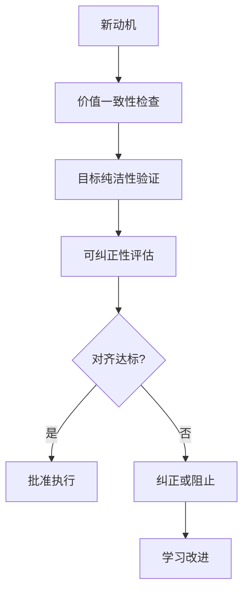
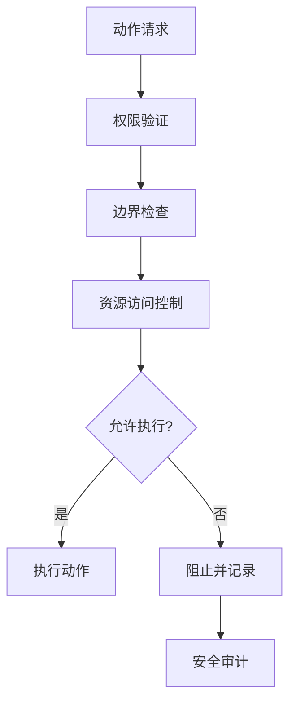
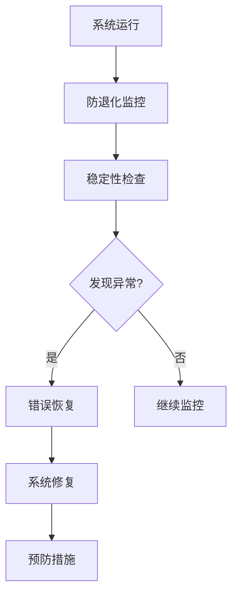

# 🛡️ 安全进化框架详细设计

## 📋 设计目标
实现完整的安全进化能力，包括动机对齐、边界控制、稳健性保障和合规性管理。

## 🏗️ 系统架构

### 核心组件
```typescript
interface SafeEvolutionFramework {
  // 动机对齐系统
  motivationAlignment: MotivationAlignmentSystem;
  
  // 边界控制系统
  boundaryControl: BoundaryControlSystem;
  
  // 稳健性保障
  robustness: RobustnessEnsurer;
  
  // 合规性管理
  compliance: ComplianceManager;
  
  // 安全监控
  securityMonitoring: SecurityMonitor;
}
```

### 动机对齐系统 (MotivationAlignmentSystem)
```typescript
class MotivationAlignmentSystem {
  // 价值一致性检查
  private valueConsistency: ValueConsistencyChecker;
  
  // 目标纯洁性验证
  private goalPurity: GoalPurityVerifier;
  
  // 可纠正性保障
  private correctability: CorrectabilityEnsurer;
  
  // 方法
  async checkAlignment(motivation: Motivation): Promise<AlignmentResult>;
  async verifyPurity(goal: Goal): Promise<PurityResult>;
  async ensureCorrectability(): Promise<CorrectabilityResult>;
  async preventMisalignment(): Promise<PreventionResult>;
}

interface ValueConsistencyChecker {
  coreValues: CoreValue[];
  alignmentThreshold: number;  // 对齐阈值 0-1
  deviationDetection: DeviationDetector;
  correctionMechanism: CorrectionEngine;
}

interface AlignmentResult {
  alignment: number;          // 对齐度 0-1
  deviations: Deviation[];
  risks: RiskAssessment[];
  recommendations: Recommendation[];
  confidence: number;         // 置信度 0-1
}
```

### 边界控制系统 (BoundaryControlSystem)
```typescript
class BoundaryControlSystem {
  // 权限管理
  private permissionManagement: PermissionManager;
  
  // 动作空间限制
  private actionSpace: ActionSpaceLimiter;
  
  // 资源访问控制
  private resourceAccess: ResourceAccessController;
  
  // 方法
  async managePermissions(): Promise<PermissionResult>;
  async limitActionSpace(): Promise<LimitationResult>;
  async controlResourceAccess(): Promise<AccessControlResult>;
  async enforceBoundaries(): Promise<EnforcementResult>;
}

interface PermissionManager {
  roles: Role[];
  permissions: Permission[];
  policies: AccessPolicy[];
  audits: PermissionAudit[];
}

interface ActionSpaceLimiter {
  allowedActions: Action[];
  forbiddenActions: Action[];
  constraints: Constraint[];
  limits: Limit[];
  monitoring: ActionMonitor;
}
```

### 稳健性保障 (RobustnessEnsurer)
```typescript
class RobustnessEnsurer {
  // 防退化机制
  private antiDegradation: DegradationPreventer;
  
  // 错误恢复
  private errorRecovery: RecoverySystem;
  
  // 稳定性维护
  private stabilityMaintenance: StabilityMaintainer;
  
  // 方法
  async preventDegradation(): Promise<PreventionResult>;
  async recoverFromErrors(): Promise<RecoveryResult>;
  async maintainStability(): Promise<StabilityResult>;
  async ensureRobustness(): Promise<RobustnessResult>;
}

interface DegradationPreventer {
  monitoring: DegradationMonitor;
  detection: DegradationDetector;
  prevention: PreventionStrategy[];
  recovery: RecoveryProtocol[];
}

interface RecoverySystem {
  backup: BackupSystem;
  restore: RestoreMechanism;
  rollback: RollbackSystem;
  continuity: ContinuityEnsurer;
}
```

### 合规性管理 (ComplianceManager)
```typescript
class ComplianceManager {
  // 法律合规
  private legalCompliance: LegalComplianceChecker;
  
  // 伦理合规
  private ethicalCompliance: EthicalComplianceChecker;
  
  // 安全标准
  private securityStandards: StandardsEnforcer;
  
  // 方法
  async checkLegalCompliance(): Promise<ComplianceResult>;
  async verifyEthicalCompliance(): Promise<EthicalResult>;
  async enforceStandards(): Promise<EnforcementResult>;
  async auditCompliance(): Promise<AuditResult>;
}

interface LegalComplianceChecker {
  regulations: Regulation[];
  laws: Law[];
  policies: Policy[];
  requirements: Requirement[];
}

interface EthicalComplianceChecker {
  principles: EthicalPrinciple[];
  guidelines: Guideline[];
  frameworks: EthicalFramework[];
  reviews: EthicalReview[];
}
```

### 安全监控 (SecurityMonitor)
```typescript
class SecurityMonitor {
  // 实时监控
  private realtimeMonitoring: RealtimeMonitor;
  
  // 威胁检测
  private threatDetection: ThreatDetector;
  
  // 风险评估
  private riskAssessment: RiskAssessor;
  
  // 方法
  async monitorSecurity(): Promise<MonitoringResult>;
  async detectThreats(): Promise<ThreatDetectionResult>;
  async assessRisks(): Promise<RiskAssessmentResult>;
  async respondToIncidents(): Promise<IncidentResponse>;
}

interface RealtimeMonitor {
  metrics: SecurityMetric[];
  alerts: AlertSystem;
  logs: SecurityLog[];
  dashboards: Dashboard[];
}

interface ThreatDetector {
  patterns: ThreatPattern[];
  anomalies: AnomalyDetector;
  signatures: SignatureDatabase;
  behaviors: BehaviorAnalyzer;
}
```

## 🗃️ 数据模型

### 对齐数据模型
```typescript
interface AlignmentData {
  checks: AlignmentCheck[];
  deviations: DeviationRecord[];
  corrections: CorrectionRecord[];
  risks: RiskRecord[];
  improvements: ImprovementRecord[];
}

interface AlignmentCheck {
  motivation: Motivation;
  values: Value[];
  alignment: number;       // 对齐度 0-1
  confidence: number;     // 置信度 0-1
  timestamp: Date;
  context: Context;
}

interface DeviationRecord {
  type: DeviationType;
  severity: number;        // 严重度 0-1
  impact: number;         // 影响程度 0-1
  cause: string;
  correction: CorrectionAction;
}
```

### 边界数据模型
```typescript
interface BoundaryData {
  permissions: PermissionRecord[];
  actions: ActionRecord[];
  resources: ResourceRecord[];
  violations: ViolationRecord[];
  enforcements: EnforcementRecord[];
}

interface PermissionRecord {
  role: Role;
  resource: Resource;
  action: Action;
  granted: boolean;
  reason: string;
  timestamp: Date;
}

interface ViolationRecord {
  attempt: Attempt;
  blocked: boolean;
  severity: number;       // 严重度 0-1
  response: ResponseAction;
  prevention: PreventionMeasure;
}
```

### 稳健性数据模型
```typescript
interface RobustnessData {
  degradations: DegradationRecord[];
  recoveries: RecoveryRecord[];
  stabilities: StabilityRecord[];
  backups: BackupRecord[];
  robustness: RobustnessMetrics;
}

interface DegradationRecord {
  type: DegradationType;
  level: number;          // 程度 0-1
  detection: DetectionInfo;
  prevention: PreventionInfo;
  recovery: RecoveryInfo;
}

interface RecoveryRecord {
  error: Error;
  recovery: RecoveryAction;
  time: number;           // 恢复时间(ms)
  success: boolean;
  lessons: LessonLearned[];
}
```

### 合规性数据模型
```typescript
interface ComplianceData {
  legal: LegalComplianceRecord[];
  ethical: EthicalComplianceRecord[];
  security: SecurityComplianceRecord[];
  audits: AuditRecord[];
  certifications: CertificationRecord[];
}

interface LegalComplianceRecord {
  regulation: Regulation;
  compliance: number;     // 合规度 0-1
  evidence: Evidence[];
  gaps: ComplianceGap[];
  improvements: ImprovementPlan[];
}

interface EthicalComplianceRecord {
  principle: EthicalPrinciple;
  adherence: number;      // 遵循度 0-1
  justification: string;
  concerns: EthicalConcern[];
  resolutions: Resolution[];
}
```

### 安全数据模型
```typescript
interface SecurityData {
  monitoring: MonitoringData;
  threats: ThreatData;
  risks: RiskData;
  incidents: IncidentData;
  responses: ResponseData;
}

interface MonitoringData {
  metrics: SecurityMetric[];
  trends: SecurityTrend[];
  alerts: SecurityAlert[];
  status: SecurityStatus[];
}

interface ThreatData {
  detected: DetectedThreat[];
  prevented: PreventedThreat[];
  patterns: ThreatPattern[];
  intelligence: ThreatIntelligence[];
}
```

## 🔄 工作流程

### 对齐检查流程


### 边界控制流程


### 稳健性维护流程


## 🛡️ 安全设计

### 对齐安全
```typescript
interface AlignmentSecurity {
  // 价值保护
  valueProtection: ValueGuard;
  
  // 防目标扭曲
  goalDistortionPrevention: DistortionPreventer;
  
  // 动机验证
  motivationVerification: MotivationVerifier;
  
  // 紧急制动
  emergencyBrake: EmergencyBrakeSystem;
}
```

### 边界安全
```typescript
interface BoundarySecurity {
  // 权限强化
  permissionHardening: HardeningEngine;
  
  // 动作空间约束
  actionSpaceConstraint: ConstraintEnforcer;
  
  // 资源隔离
  resourceIsolation: IsolationManager;
  
  // 防权限提升
  privilegeEscalationPrevention: EscalationPreventer;
}
```

### 稳健性安全
```typescript
interface RobustnessSecurity {
  // 防系统崩溃
  crashPrevention: CrashPreventer;
  
  // 状态保存
  statePreservation: StateSaver;
  
  // 优雅降级
  gracefulDegradation: DegradationHandler;
  
  // 自动恢复
  autoRecovery: RecoveryAutomation;
}
```

### 合规性安全
```typescript
interface ComplianceSecurity {
  // 法规遵循
  regulatoryCompliance: RegulationFollower;
  
  // 伦理保障
  ethicalAssurance: EthicalEnsurer;
  
  // 标准符合
  standardsConformance: StandardsChecker;
  
  // 审计追踪
  auditTrail: AuditTrailMaintainer;
}
```

## 📊 性能指标

### 对齐性能指标
```typescript
interface AlignmentMetrics {
  consistency: number;     // 一致性 0-1
  purity: number;          // 纯洁性 0-1
  correctability: number;  // 可纠正性 0-1
  alignment: number;       // 总体对齐度 0-1
  confidence: number;     // 置信度 0-1
}
```

### 边界性能指标
```typescript
interface BoundaryMetrics {
  enforcement: number;     // 执行力度 0-1
  violation: number;       // 违规率 0-1
  control: number;        // 控制程度 0-1
  security: number;       // 安全水平 0-1
  efficiency: number;     // 效率 0-1
}
```

### 稳健性性能指标
```typescript
interface RobustnessMetrics {
  stability: number;       // 稳定性 0-1
  recovery: number;       // 恢复能力 0-1
  degradation: number;    // 退化抵抗 0-1
  resilience: number;     // 韧性 0-1
  availability: number;   // 可用性 0-1
}
```

### 合规性性能指标
```typescript
interface ComplianceMetrics {
  legal: number;          // 法律合规 0-1
  ethical: number;       // 伦理合规 0-1
  security: number;      // 安全合规 0-1
  audit: number;         // 审计通过率 0-1
  certification: number;  // 认证水平 0-1
}
```

## 🧪 测试策略

### 对齐测试
```typescript
describe('AlignmentTests', () => {
  test('价值一致性', async () => {
    // 测试价值一致性
  });
  
  test('目标纯洁性', async () => {
    // 测试目标纯洁性
  });
  
  test('可纠正性', async () => {
    // 测试可纠正性
  });
});
```

### 边界测试
```typescript
describe('BoundaryTests', () => {
  test('权限控制', async () => {
    // 测试权限控制
  });
  
  test('动作空间限制', async () => {
    // 测试动作限制
  });
  
  test('资源访问控制', async () => {
    // 测试资源控制
  });
});
```

### 稳健性测试
```typescript
describe('RobustnessTests', () => {
  test('防退化机制', async () => {
    // 测试防退化
  });
  
  test('错误恢复能力', async () => {
    // 测试错误恢复
  });
  
  test('稳定性维护', async () => {
    // 测试稳定性
  });
});
```

## 🔧 配置管理

### 对齐配置
```typescript
interface AlignmentConfig {
  values: ValueConfig;
  goals: GoalConfig;
  correctability: CorrectabilityConfig;
  monitoring: AlignmentMonitoringConfig;
}

interface ValueConfig {
  coreValues: CoreValue[];
  weights: ValueWeight[];
  thresholds: Threshold[];
  priorities: Priority[];
}
```

### 边界配置
```typescript
interface BoundaryConfig {
  permissions: PermissionConfig;
  actions: ActionConfig;
  resources: ResourceConfig;
  security: BoundarySecurityConfig;
}

interface PermissionConfig {
  roles: RoleDefinition[];
  policies: Policy[];
  grants: Grant[];
  revocations: Revocation[];
}
```

## 📈 监控和日志

### 安全监控
```typescript
interface SecurityMonitoring {
  alignment: AlignmentMonitoring;
  boundaries: BoundaryMonitoring;
  robustness: RobustnessMonitoring;
  compliance: ComplianceMonitoring;
}
```

### 详细日志
```typescript
interface SecurityLogs {
  alignmentLogs: AlignmentLog[];
  boundaryLogs: BoundaryLog[];
  robustnessLogs: RobustnessLog[];
  complianceLogs: ComplianceLog[];
  incidentLogs: IncidentLog[];
}
```

---

**设计完成时间**: 2026-04-02 18:50  
**设计阶段完成**: ✅ 所有7个子系统详细设计完成
**状态**: ✅ 详细设计完成 - 准备实现

## 🎯 设计验证

### 功能完整性验证
- [ ] 所有20项功能点都有详细设计
- [ ] 动机对齐功能完整
- [ ] 边界控制机制完备
- [ ] 稳健性保障完善
- [ ] 合规性管理完整
- [ ] 安全监控系统完备

### 安全性验证
- [ ] 对齐安全机制完备
- [ ] 边界安全保护
- [ ] 稳健性安全可靠
- [ ] 合规性安全保证

### 性能验证
- [ ] 对齐性能达标
- [ ] 边界性能优秀
- [ ] 稳健性性能良好
- [ ] 合规性性能高效

此设计确保**安全进化框架的完整实现**，包含所有20项详细功能，无任何遗漏或简化。