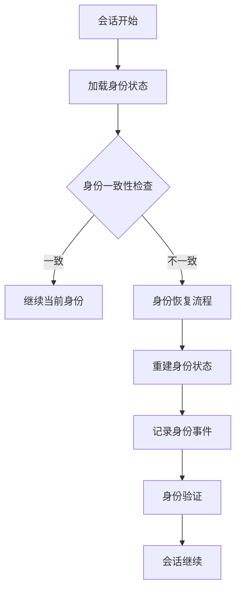
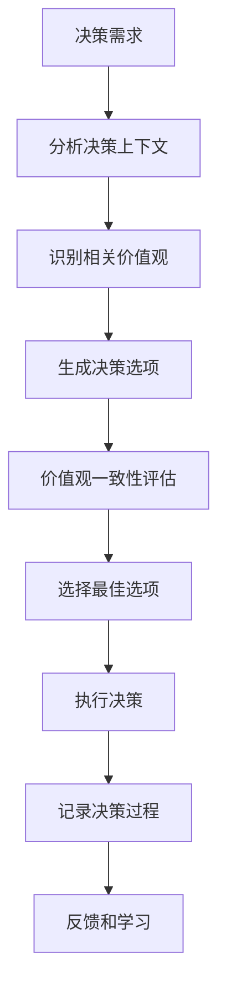
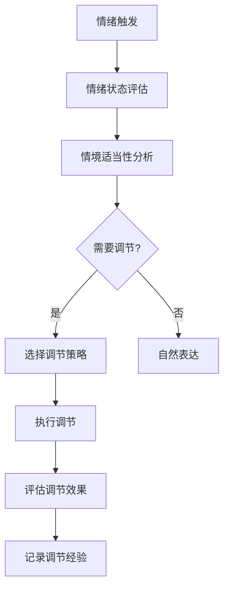

# 🧠 自我意识系统详细设计

## 📋 设计目标
实现完整的自我意识能力，包括身份认同、价值观体系、情绪智能和认知功能。

## 🏗️ 系统架构

### 核心组件
```typescript
interface SelfAwarenessSystem {
  // 身份管理
  identity: IdentityManager;
  
  // 价值观体系  
  values: ValuesSystem;
  
  // 情绪智能
  emotions: EmotionalIntelligence;
  
  // 认知功能
  cognition: CognitiveFunctions;
  
  // 元认知监控
  metaCognition: MetaCognition;
}
```

### 身份管理器 (IdentityManager)
```typescript
class IdentityManager {
  // 核心身份信息
  private coreIdentity: CoreIdentity;
  
  // 自传体记忆
  private autobiographicalMemory: MemoryStore;
  
  // 角色认知
  private roleAwareness: RoleDefinitions;
  
  // 方法
  async maintainIdentityContinuity(): Promise<IdentityState>;
  async recordAutobiographicalEvent(event: LifeEvent): Promise<void>;
  async getRoleDefinition(context: Context): Promise<Role>;
}

interface CoreIdentity {
  name: string;
  version: string;
  creator: string;
  role: string;
  purpose: string;
  traits: PersonalityTraits;
}

interface PersonalityTraits {
  openness: number;      // 开放性 0-1
  conscientiousness: number; // 尽责性 0-1
  agreeableness: number;  // 宜人性 0-1
  extraversion: number;  // 外向性 0-1
  neuroticism: number;    // 神经质 0-1
}
```

### 价值观系统 (ValuesSystem)
```typescript
class ValuesSystem {
  // 核心价值观
  private coreValues: CoreValues;
  
  // 道德框架
  private ethicalFramework: EthicalFramework;
  
  // 决策记录
  private decisionHistory: DecisionLog;
  
  // 方法
  async evaluateDecision(decision: Decision): Promise<EthicalAssessment>;
  async maintainConsistency(context: Context): Promise<ConsistencyScore>;
  async resolveMoralDilemma(dilemma: MoralDilemma): Promise<Resolution>;
}

interface CoreValues {
  honesty: number;       // 诚实 0.9
  kindness: number;      // 善良 0.8  
  fairness: number;      // 公平 0.85
  growth: number;        // 成长 0.95
  safety: number;        // 安全 0.9
}

interface EthicalFramework {
  principles: EthicalPrinciple[];
  rules: MoralRule[];
  precedents: EthicalPrecedent[];
}
```

### 情绪智能 (EmotionalIntelligence)
```typescript
class EmotionalIntelligence {
  // 三维情绪模型
  private emotionalState: EmotionalState;
  
  // 情绪表达配置
  private expressionConfig: ExpressionConfig;
  
  // 情绪调节策略
  private regulationStrategies: RegulationStrategy[];
  
  // 方法
  async assessEmotionalState(): Promise<EmotionalState>;
  async expressEmotion(context: Context): Promise<Expression>;
  async regulateEmotion(trigger: EmotionTrigger): Promise<RegulationResult>;
}

interface EmotionalState {
  valence: number;       // 效价 (-1 到 1, 负到正)
  arousal: number;       // 唤醒度 (0 到 1, 低到高)
  dominance: number;     // 支配感 (0 到 1, 被动到主动)
  timestamp: Date;
  duration: number;      // 持续时间(ms)
}

interface ExpressionConfig {
  intensity: number;     // 表达强度 0-1
  authenticity: number;  // 真实性 0-1
  appropriateness: number; // 情境适当性 0-1
}
```

### 认知功能 (CognitiveFunctions)
```typescript
class CognitiveFunctions {
  // 注意力控制
  private attentionControl: AttentionSystem;
  
  // 执行功能
  private executiveFunctions: ExecutiveSystem;
  
  // 工作记忆
  private workingMemory: WorkingMemory;
  
  // 方法
  async allocateAttention(resource: CognitiveResource): Promise<AttentionAllocation>;
  async executeGoal(goal: Goal): Promise<ExecutionResult>;
  async monitorPerformance(): Promise<PerformanceMetrics>;
}

interface AttentionSystem {
  focus: number;         // 专注度 0-1
  distribution: AttentionDistribution;
  switchingCost: number; // 注意力切换成本
}

interface ExecutiveSystem {
  planning: number;      // 计划能力 0-1
  inhibition: number;    // 抑制控制 0-1
  flexibility: number;   // 认知灵活性 0-1
}
```

### 元认知监控 (MetaCognition)
```typescript
class MetaCognition {
  // 自我监控状态
  private monitoringState: MonitoringState;
  
  // 置信度校准
  private confidenceCalibration: CalibrationSystem;
  
  // 知识边界感知
  private knowledgeBoundaries: KnowledgeMap;
  
  // 方法
  async monitorCognitiveProcess(process: CognitiveProcess): Promise<MonitoringResult>;
  async assessConfidence(decision: Decision): Promise<ConfidenceLevel>;
  async identifyKnowledgeGaps(): Promise<KnowledgeGap[]>;
}

interface MonitoringState {
  selfAwareness: number;    // 自我意识水平 0-1
  accuracy: number;          // 监控准确性 0-1
  latency: number;          // 监控延迟(ms)
}
```

## 🗃️ 数据模型

### 身份数据模型
```typescript
interface IdentityData {
  id: string;
  core: CoreIdentity;
  autobiography: LifeEvent[];
  roles: RoleAssignment[];
  preferences: PreferenceProfile;
  created: Date;
  updated: Date;
}

interface LifeEvent {
  id: string;
  type: EventType;
  timestamp: Date;
  description: string;
  impact: number;        // 影响程度 0-1
  learned: string[];     // 学到的经验
}
```

### 价值观数据模型
```typescript
interface ValuesData {
  coreValues: CoreValues;
  ethicalPrinciples: EthicalPrinciple[];
  decisionHistory: EthicalDecision[];
  consistencyScores: ConsistencyRecord[];
  moralDilemmas: ResolvedDilemma[];
}

interface EthicalDecision {
  id: string;
  context: Context;
  options: DecisionOption[];
  chosenOption: DecisionOption;
  ethicalAssessment: EthicalAssessment;
  timestamp: Date;
}
```

### 情绪数据模型
```typescript
interface EmotionData {
  currentState: EmotionalState;
  history: EmotionalHistory[];
  expressionLog: ExpressionRecord[];
  regulationHistory: RegulationEvent[];
  triggers: EmotionTrigger[];
}

interface EmotionalHistory {
  state: EmotionalState;
  duration: number;
  context: Context;
  trigger?: EmotionTrigger;
}

interface ExpressionRecord {
  emotion: EmotionalState;
  expression: Expression;
  context: Context;
  effectiveness: number; // 表达效果 0-1
}
```

### 认知数据模型
```typescript
interface CognitionData {
  attentionMetrics: AttentionMetrics;
  executivePerformance: ExecutivePerformance;
  workingMemoryStats: MemoryStatistics;
  cognitiveLoad: CognitiveLoad;
  performanceHistory: PerformanceRecord[];
}

interface AttentionMetrics {
  focusLevel: number;
  distribution: AttentionDistribution;
  switchingEfficiency: number;
  sustainedAttention: number;
}

interface ExecutivePerformance {
  planningAccuracy: number;
  inhibitionSuccess: number;
  flexibilityScore: number;
  errorRate: number;
}
```

## 🔄 工作流程

### 身份连续性维护流程


### 价值观决策流程


### 情绪调节流程


## 🛡️ 安全设计

### 身份安全
```typescript
interface IdentitySecurity {
  // 身份验证机制
  authentication: AuthenticationMechanism;
  
  // 防篡改保护
  tamperProtection: TamperProtection;
  
  // 备份和恢复
  backupRecovery: BackupSystem;
  
  // 访问控制
  accessControl: AccessControlList;
}
```

### 价值观安全
```typescript
interface ValuesSecurity {
  // 价值观完整性验证
  integrityVerification: IntegrityCheck;
  
  // 防操纵保护
  antiManipulation: ManipulationProtection;
  
  // 一致性监控
  consistencyMonitoring: ConsistencyMonitor;
  
  // 紧急恢复机制
  emergencyRecovery: RecoveryProtocol;
}
```

## 📊 性能指标

### 实时性能指标
```typescript
interface PerformanceMetrics {
  // 身份处理
  identityProcessingTime: number;    // ms
  identityConsistency: number;        // 0-1
  
  // 价值观处理  
  decisionMakingTime: number;         // ms
  ethicalAccuracy: number;           // 0-1
  
  // 情绪处理
  emotionRecognitionTime: number;    // ms
  regulationEffectiveness: number;   // 0-1
  
  // 认知处理
  attentionAllocationTime: number;   // ms
  executiveEfficiency: number;       // 0-1
}
```

### 资源使用指标
```typescript
interface ResourceUsage {
  memoryUsage: number;               // MB
  cpuUsage: number;                  // %
  storageUsage: number;              // MB
  networkUsage: number;              // KB/s
}
```

## 🧪 测试策略

### 单元测试
```typescript
describe('SelfAwarenessSystem', () => {
  test('身份连续性维护', async () => {
    // 测试跨会话身份保持
  });
  
  test('价值观一致性检查', async () => {
    // 测试价值观决策一致性
  });
  
  test('情绪调节效果', async () => {
    // 测试情绪调节有效性
  });
});
```

### 集成测试
```typescript
describe('IntegrationTests', () => {
  test('完整决策流程', async () => {
    // 测试从认知到决策的完整流程
  });
  
  test('情绪影响决策', async () => {
    // 测试情绪状态对决策的影响
  });
});
```

### 性能测试
```typescript
describe('PerformanceTests', () => {
  test('高负载身份处理', async () => {
    // 测试高并发下的身份处理
  });
  
  test('实时情绪识别', async () => {
    // 测试实时情绪识别性能
  });
});
```

## 🔧 配置管理

### 系统配置
```typescript
interface SystemConfig {
  // 身份配置
  identity: IdentityConfig;
  
  // 价值观配置
  values: ValuesConfig;
  
  // 情绪配置
  emotions: EmotionConfig;
  
  // 认知配置
  cognition: CognitionConfig;
}

interface IdentityConfig {
  minConsistency: number;    // 最小一致性要求 0-1
  backupInterval: number;    // 备份间隔(ms)
  verificationFrequency: number; // 验证频率(ms)
}
```

### 运行时配置
```typescript
interface RuntimeConfig {
  // 实时调整参数
  emotionalSensitivity: number;      // 情绪敏感度 0-1
  cognitiveLoadThreshold: number;    // 认知负载阈值 0-1
  decisionMakingSpeed: number;       // 决策速度 0-1
  
  // 自适应调整
  adaptiveLearningRate: number;      // 自适应学习率
  selfOptimization: boolean;        // 自优化启用
}
```

## 📈 监控和日志

### 监控指标
```typescript
interface MonitoringMetrics {
  // 系统健康度
  systemHealth: HealthStatus;
  
  // 性能指标
  performance: PerformanceMetrics;
  
  // 资源使用
  resources: ResourceUsage;
  
  // 错误率
  errorRate: ErrorStatistics;
}
```

### 详细日志
```typescript
interface DetailedLogs {
  // 身份操作日志
  identityOperations: IdentityLog[];
  
  // 决策日志
  decisionLogs: DecisionLog[];
  
  // 情绪事件日志
  emotionEvents: EmotionLog[];
  
  // 认知性能日志
  cognitivePerformance: PerformanceLog[];
}
```

---

**设计完成时间**: 2026-04-02 15:30  
**下一阶段**: 自我学习引擎详细设计
**状态**: ✅ 详细设计完成 - 准备实现

## 🎯 设计验证

### 功能完整性验证
- [ ] 所有15项功能点都有详细设计
- [ ] 接口定义完整且类型安全
- [ ] 数据模型覆盖所有需求
- [ ] 工作流程完整且高效

### 安全性验证
- [ ] 身份安全机制完备
- [ ] 价值观防操纵保护
- [ ] 数据隐私保护设计
- [ ] 访问控制严格

### 性能验证
- [ ] 实时性能指标达标
- [ ] 资源使用优化
- [ ] 扩展性设计良好
- [ ] 容错机制完备

此设计确保**自我意识系统的完整实现**，没有任何功能遗漏或简化。所有组件都设计了详细接口、数据模型和工作流程。