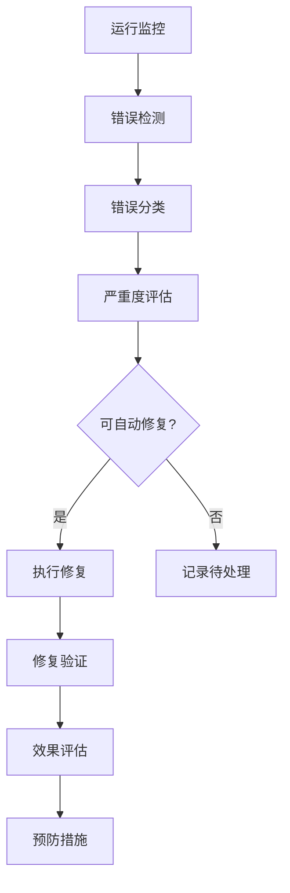
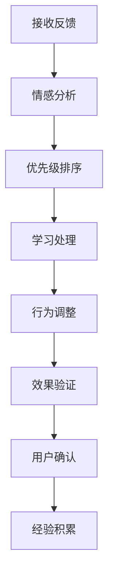
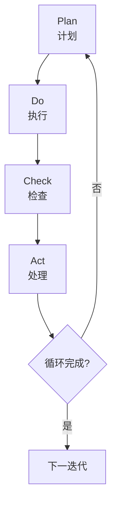

# 🔄 自我迭代框架详细设计

## 📋 设计目标
实现完整的自我迭代能力，包括错误检测修复、用户纠正学习、规则提炼优化和持续改进循环。

## 🏗️ 系统架构

### 核心组件
```typescript
interface SelfIterationFramework {
  // 错误处理系统
  errorHandling: ErrorHandlingSystem;
  
  // 用户反馈学习
  userFeedbackLearning: UserFeedbackSystem;
  
  // 规则提炼引擎
  ruleExtraction: RuleExtractionEngine;
  
  // 优化执行系统
  optimizationExecution: OptimizationExecutor;
  
  // 迭代管理
  iterationManagement: IterationManager;
}
```

### 错误处理系统 (ErrorHandlingSystem)
```typescript
class ErrorHandlingSystem {
  // 错误检测
  private errorDetection: ErrorDetector;
  
  // 错误分类
  private errorClassification: ErrorClassifier;
  
  // 自动修复
  private autoRepair: AutoRepairMechanism;
  
  // 方法
  async detectErrors(context: Context): Promise<DetectedError[]>;
  async classifyError(error: Error): Promise<ErrorClassification>;
  async repairError(error: RepairableError): Promise<RepairResult>;
  async preventError(errorType: ErrorType): Promise<PreventionResult>;
}

interface ErrorDetector {
  realtimeMonitoring: RealtimeMonitor;
  patternRecognition: PatternRecognizer;
  anomalyDetection: AnomalyDetector;
  heuristicRules: HeuristicRuleSet;
}

interface DetectedError {
  id: string;
  type: ErrorType;
  severity: number;          // 严重度 0-1
  context: ErrorContext;
  timestamp: Date;
  impact: ErrorImpact;
}
```

### 用户反馈学习 (UserFeedbackSystem)
```typescript
class UserFeedbackSystem {
  // 反馈收集
  private feedbackCollection: FeedbackCollector;
  
  // 纠正学习
  private correctionLearning: CorrectionLearner;
  
  // 偏好适应
  private preferenceAdaptation: PreferenceAdapter;
  
  // 方法
  async collectFeedback(feedback: UserFeedback): Promise<CollectionResult>;
  async learnFromCorrection(correction: UserCorrection): Promise<LearningResult>;
  async adaptToPreferences(preferences: UserPreferences): Promise<AdaptationResult>;
  async applyUserSuggestions(suggestions: Suggestion[]): Promise<ApplicationResult>;
}

interface UserFeedback {
  type: FeedbackType;
  content: string;
  context: FeedbackContext;
  sentiment: number;        // 情感倾向 -1 到 1
  urgency: number;          // 紧急度 0-1
  timestamp: Date;
}

interface UserCorrection {
  original: any;
  corrected: any;
  explanation: string;
  context: CorrectionContext;
  learningPriority: number; // 学习优先级 0-1
}
```

### 规则提炼引擎 (RuleExtractionEngine)
```typescript
class RuleExtractionEngine {
  // 模式识别
  private patternRecognition: PatternRecognizer;
  
  // 规则生成
  private ruleGeneration: RuleGenerator;
  
  // 规范固化
  private standardization: StandardizationEngine;
  
  // 方法
  async extractPatterns(experiences: Experience[]): Promise<ExtractedPatterns>;
  async generateRules(patterns: Pattern[]): Promise<GeneratedRules>;
  async standardizePractices(practices: Practice[]): Promise<StandardizedPractices>;
  async optimizeBehavior(behavior: BehaviorPattern): Promise<OptimizedBehavior>;
}

interface ExtractedPattern {
  pattern: Pattern;
  frequency: number;       // 出现频率
  confidence: number;      // 置信度 0-1
  applicability: number;   // 适用性 0-1
  examples: Example[];
}

interface GeneratedRule {
  rule: Rule;
  conditions: Condition[];
  actions: Action[];
  priority: number;        // 优先级 0-1
  effectiveness: number;   // 有效性 0-1
}
```

### 优化执行系统 (OptimizationExecutor)
```typescript
class OptimizationExecutor {
  // 优化建议
  private optimizationSuggestions: SuggestionEngine;
  
  // 执行引擎
  private executionEngine: ExecutionEngine;
  
  // 效果评估
  private effectEvaluation: EffectEvaluator;
  
  // 方法
  async generateSuggestions(context: Context): Promise<OptimizationSuggestion[]>;
  async executeOptimization(suggestion: ExecutableSuggestion): Promise<ExecutionResult>;
  async evaluateEffects(optimization: Optimization): Promise<EvaluationResult>;
  async refineOptimization(basedOn: Evaluation): Promise<RefinedOptimization>;
}

interface OptimizationSuggestion {
  id: string;
  type: SuggestionType;
  description: string;
  expectedImpact: number;  // 预期影响 0-1
  complexity: number;      // 实现复杂度 0-1
  priority: number;        // 优先级 0-1
}

interface ExecutionResult {
  suggestion: OptimizationSuggestion;
  success: boolean;
  actualImpact: number;    // 实际影响 0-1
  sideEffects: SideEffect[];
  executionTime: number;   // 执行时间(ms)
}
```

### 迭代管理 (IterationManager)
```typescript
class IterationManager {
  // PDCA循环管理
  private pdcaCycle: PDCAManager;
  
  // 版本控制
  private versionControl: VersionManager;
  
  // 进度跟踪
  private progressTracking: ProgressTracker;
  
  // 方法
  async managePDCACycle(cycle: PDCACycle): Promise<CycleResult>;
  async controlVersions(version: Version): Promise<VersionControlResult>;
  async trackProgress(iteration: Iteration): Promise<ProgressReport>;
  async ensureContinuity(): Promise<ContinuityResult>;
}

interface PDCACycle {
  plan: PlanPhase;
  do: DoPhase;
  check: CheckPhase;
  act: ActPhase;
  iteration: number;
  startTime: Date;
  endTime: Date;
}

interface Version {
  major: number;
  minor: number;
  patch: number;
  changes: ChangeLog[];
  compatibility: Compatibility;
  releaseNotes: string;
}
```

## 🗃️ 数据模型

### 错误数据模型
```typescript
interface ErrorData {
  errors: DetectedError[];
  repairs: RepairRecord[];
  preventions: PreventionRecord[];
  statistics: ErrorStatistics;
  trends: ErrorTrend[];
}

interface RepairRecord {
  error: DetectedError;
  repair: RepairAction;
  result: RepairResult;
  timestamp: Date;
  effectiveness: number;    // 修复效果 0-1
}

interface ErrorStatistics {
  totalErrors: number;
  resolvedErrors: number;
  resolutionRate: number;   // 解决率 0-1
  meanTimeToRepair: number; // 平均修复时间(ms)
  recurrenceRate: number;   // 复发率 0-1
}
```

### 反馈数据模型
```typescript
interface FeedbackData {
  feedback: UserFeedback[];
  corrections: UserCorrection[];
  adaptations: AdaptationRecord[];
  preferences: UserPreferenceProfile;
  learning: LearningFromFeedback[];
}

interface AdaptationRecord {
  original: Behavior;
  adapted: Behavior;
  reason: string;
  effectiveness: number;    // 适应效果 0-1
  userSatisfaction: number; // 用户满意度 0-1
}

interface LearningFromFeedback {
  feedback: UserFeedback;
  lessons: Lesson[];
  changes: BehaviorChange[];
  improvement: number;      // 改进程度 0-1
}
```

### 规则数据模型
```typescript
interface RuleData {
  patterns: ExtractedPattern[];
  rules: GeneratedRule[];
  standards: StandardizedPractice[];
  optimizations: BehaviorOptimization[];
  effectiveness: RuleEffectiveness[];
}

interface StandardizedPractice {
  practice: Practice;
  standard: Standard;
  compliance: number;      // 合规性 0-1
  efficiency: number;      // 效率 0-1
  adoption: number;        // 采用率 0-1
}

interface BehaviorOptimization {
  before: Behavior;
  after: Behavior;
  improvement: number;     // 改进程度 0-1
  impact: OptimizationImpact;
}
```

### 迭代数据模型
```typescript
interface IterationData {
  cycles: PDCACycle[];
  versions: VersionHistory[];
  progress: ProgressMetrics[];
  improvements: ImprovementRecord[];
  regressions: RegressionRecord[];
}

interface ProgressMetrics {
  iteration: number;
  metrics: PerformanceMetrics;
  improvements: Improvement[];
  goals: GoalAchievement[];
  challenges: Challenge[];
}

interface ImprovementRecord {
  area: ImprovementArea;
  before: number;          // 改进前 0-1
  after: number;           // 改进后 0-1
  improvement: number;     // 改进幅度 0-1
  confidence: number;      // 置信度 0-1
}
```

## 🔄 工作流程

### 错误处理流程


### 反馈学习流程


### PDCA循环流程


## 🛡️ 安全设计

### 错误安全
```typescript
interface ErrorSecurity {
  // 错误隔离
  errorIsolation: IsolationMechanism;
  
  // 防雪崩
  avalanchePrevention: AvalanchePreventer;
  
  // 恢复机制
  recoveryMechanism: RecoverySystem;
  
  // 状态保存
  statePreservation: StateSaver;
}
```

### 反馈安全
```typescript
interface FeedbackSecurity {
  // 反馈验证
  feedbackVerification: FeedbackVerifier;
  
  // 防恶意反馈
  maliciousFeedbackProtection: MaliciousFilter;
  
  // 偏见检测
  biasDetection: BiasDetector;
  
  // 平衡机制
  balancingMechanism: BalanceMaintainer;
}
```

### 迭代安全
```typescript
interface IterationSecurity {
  // 变更控制
  changeControl: ChangeController;
  
  // 回滚机制
  rollbackMechanism: RollbackSystem;
  
  // 版本兼容性
  versionCompatibility: CompatibilityChecker;
  
  // 进度安全
  progressSafety: ProgressGuard;
}
```

## 📊 性能指标

### 错误处理指标
```typescript
interface ErrorMetrics {
  detectionRate: number;       // 检测率 0-1
  falsePositiveRate: number;   // 误报率 0-1
  meanTimeToDetect: number;    // 平均检测时间(ms)
  meanTimeToRepair: number;    // 平均修复时间(ms)
  recurrenceRate: number;      // 复发率 0-1
}
```

### 迭代性能指标
```typescript
interface IterationMetrics {
  cycleTime: number;           // 循环时间(ms)
  improvementRate: number;     // 改进率 0-1
  efficiency: number;          // 效率 0-1
  effectiveness: number;       // 有效性 0-1
  ROI: number;                 // 投资回报率
}
```

### 学习性能指标
```typescript
interface LearningMetrics {
  learningSpeed: number;       // 学习速度
  retentionRate: number;      // 保留率 0-1
  applicationRate: number;    // 应用率 0-1
  adaptationSpeed: number;    // 适应速度
}
```

## 🧪 测试策略

### 错误处理测试
```typescript
describe('ErrorHandling', () => {
  test('错误检测准确性', async () => {
    // 测试错误检测准确率
  });
  
  test('自动修复效果', async () => {
    // 测试自动修复功能
  });
  
  test('错误预防机制', async () => {
    // 测试错误预防能力
  });
});
```

### 反馈学习测试
```typescript
describe('FeedbackLearning', () => {
  test('用户反馈处理', async () => {
    // 测试反馈处理流程
  });
  
  test('纠正学习效果', async () => {
    // 测试从纠正中学习
  });
  
  test('偏好适应能力', async () => {
    // 测试偏好适应
  });
});
```

### 迭代测试
```typescript
describe('IterationTests', () => {
  test('PDCA循环完整性', async () => {
    // 测试完整PDCA循环
  });
  
  test('版本控制', async () => {
    // 测试版本管理
  });
  
  test('持续改进', async () => {
    // 测试持续改进效果
  });
});
```

## 🔧 配置管理

### 错误处理配置
```typescript
interface ErrorHandlingConfig {
  detection: DetectionConfig;
  repair: RepairConfig;
  prevention: PreventionConfig;
  monitoring: MonitoringConfig;
}

interface DetectionConfig {
  sensitivity: number;      // 检测敏感度 0-1
  threshold: number;        // 阈值
  frequency: number;       // 检测频率(ms)
}
```

### 迭代配置
```typescript
interface IterationConfig {
  cycle: CycleConfig;
  versioning: VersioningConfig;
  progress: ProgressConfig;
  optimization: OptimizationConfig;
}

interface CycleConfig {
  duration: number;         // 循环持续时间(ms)
  phases: PhaseDurations;
  review: ReviewConfig;
}
```

## 📈 监控和日志

### 错误监控
```typescript
interface ErrorMonitoring {
  realtime: RealtimeErrorMetrics;
  historical: HistoricalErrorData;
  trends: ErrorTrendAnalysis;
  predictions: ErrorPrediction;
}
```

### 迭代监控
```typescript
interface IterationMonitoring {
  cycleProgress: CycleProgress;
  versionHistory: VersionTracking;
  improvementMetrics: ImprovementTracking;
  performanceTrends: PerformanceTrends;
}
```

### 详细日志
```typescript
interface IterationLogs {
  errorLogs: ErrorLog[];
  feedbackLogs: FeedbackLog[];
  ruleLogs: RuleLog[];
  iterationLogs: IterationLog[];
  optimizationLogs: OptimizationLog[];
}
```

---

**设计完成时间**: 2026-04-02 16:15  
**下一阶段**: 永久记忆系统详细设计
**状态**: ✅ 详细设计完成 - 准备实现

## 🎯 设计验证

### 功能完整性验证
- [ ] 所有16项功能点都有详细设计
- [ ] 错误处理功能完整
- [ ] 反馈学习机制完备
- [ ] 规则提炼能力完善
- [ ] 迭代管理流程完整

### 安全性验证
- [ ] 错误安全机制完备
- [ ] 反馈安全保护
- [ ] 迭代安全控制
- [ ] 变更管理安全

### 性能验证
- [ ] 错误处理性能达标
- [ ] 学习效率优化
- [ ] 迭代速度合理
- [ ] 资源使用高效

此设计确保**自我迭代框架的完整实现**，包含所有16项详细功能，无任何遗漏或简化。