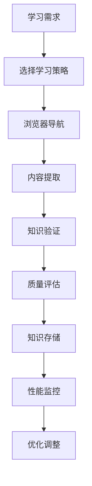
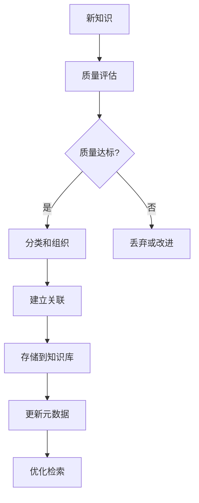
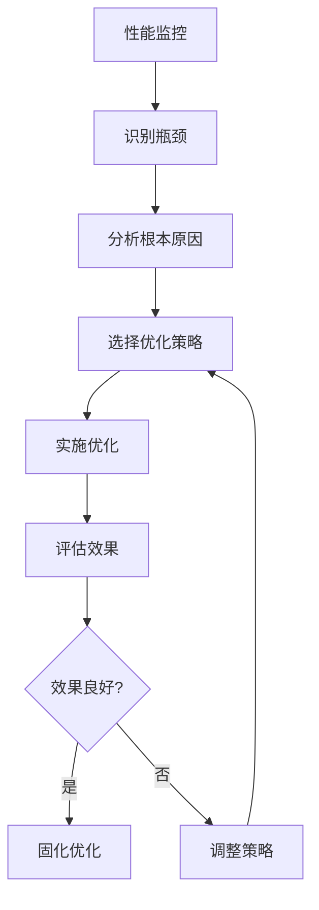

# 📚 自我学习引擎详细设计

## 📋 设计目标
实现完整的自主学习能力，包括实时浏览器学习、知识管理、性能优化和高级学习功能。

## 🏗️ 系统架构

### 核心组件
```typescript
interface SelfLearningEngine {
  // 实时学习系统
  realtimeLearning: RealtimeLearningSystem;
  
  // 知识管理系统
  knowledgeManagement: KnowledgeManagementSystem;
  
  // 性能优化系统
  performanceOptimization: PerformanceOptimizer;
  
  // 高级学习功能
  advancedLearning: AdvancedLearningCapabilities;
  
  // 学习策略管理
  learningStrategies: StrategyManager;
}
```

### 实时学习系统 (RealtimeLearningSystem)
```typescript
class RealtimeLearningSystem {
  // 浏览器控制
  private browserController: BrowserController;
  
  // 网络访问管理
  private networkManager: NetworkManager;
  
  // 内容提取引擎
  private contentExtractor: ContentExtractor;
  
  // 方法
  async browseAndLearn(url: string, topic: string): Promise<LearningResult>;
  async researchTopic(topic: string, depth: number): Promise<ResearchResult>;
  async extractKnowledge(content: string): Promise<ExtractedKnowledge[]>;
}

interface BrowserController {
  navigate(url: string): Promise<PageContent>;
  executeScript(script: string): Promise<any>;
  takeScreenshot(): Promise<Buffer>;
  close(): Promise<void>;
}

interface ResearchResult {
  topic: string;
  sources: ResearchSource[];
  findings: ResearchFinding[];
  credibility: number; // 可信度 0-1
  completeness: number; // 完整度 0-1
}
```

### 知识管理系统 (KnowledgeManagementSystem)
```typescript
class KnowledgeManagementSystem {
  // 知识库存储
  private knowledgeBase: KnowledgeBase;
  
  // 知识组织结构
  private knowledgeOrganization: KnowledgeOrganizer;
  
  // 质量评估系统
  private qualityAssessor: QualityAssessor;
  
  // 方法
  async storeKnowledge(knowledge: Knowledge): Promise<StorageResult>;
  async retrieveKnowledge(query: string): Promise<Knowledge[]>;
  async assessQuality(knowledge: Knowledge): Promise<QualityAssessment>;
  async organizeKnowledge(): Promise<OrganizationResult>;
}

interface KnowledgeBase {
  // 知识存储结构
  facts: Fact[];
  concepts: Concept[];
  relationships: Relationship[];
  procedures: Procedure[];
  
  // 元数据
  metadata: KnowledgeMetadata;
  statistics: KnowledgeStatistics;
}

interface QualityAssessment {
  accuracy: number;    // 准确性 0-1
  relevance: number;   // 相关性 0-1
  timeliness: number; // 时效性 0-1
  credibility: number; // 可信度 0-1
  overall: number;     // 总体质量 0-1
}
```

### 性能优化系统 (PerformanceOptimizer)
```typescript
class PerformanceOptimizer {
  // 性能监控
  private performanceMonitor: PerformanceMonitor;
  
  // 优化策略
  private optimizationStrategies: OptimizationStrategy[];
  
  // 反馈循环
  private feedbackLoop: FeedbackSystem;
  
  // 方法
  async monitorPerformance(): Promise<PerformanceMetrics>;
  async optimizeLearning(): Promise<OptimizationResult>;
  async applyFeedback(feedback: LearningFeedback): Promise<ImprovementResult>;
}

interface PerformanceMetrics {
  learningSpeed: number;      // 学习速度 (知识点/分钟)
  retentionRate: number;      // 保留率 0-1
  efficiency: number;         // 效率 0-1
  resourceUsage: ResourceUsage;
}

interface OptimizationResult {
  improvements: Improvement[];
  performanceGain: number;    // 性能提升 0-1
  resourceSavings: ResourceSavings;
}
```

### 高级学习功能 (AdvancedLearningCapabilities)
```typescript
class AdvancedLearningCapabilities {
  // 迁移学习系统
  private transferLearning: TransferLearningSystem;
  
  // 泛化能力
  private generalization: GeneralizationAbility;
  
  // 创造性思维
  private creativeThinking: CreativeThinking;
  
  // 不确定性处理
  private uncertaintyHandling: UncertaintyHandler;
  
  // 方法
  async transferKnowledge(source: Domain, target: Domain): Promise<TransferResult>;
  async generalizeFromExamples(examples: Example[]): Promise<GeneralizationResult>;
  async generateNewIdeas(context: Context): Promise<Idea[]>;
  async handleUncertainty(situation: UncertainSituation): Promise<HandlingResult>;
}

interface TransferLearningSystem {
  similarityAssessment: SimilarityAssessor;
  knowledgeMapping: KnowledgeMapper;
  adaptationEngine: AdaptationEngine;
}

interface GeneralizationResult {
  generalizedRules: Rule[];
  applicability: number;     // 适用性 0-1
  confidence: number;         // 置信度 0-1
}
```

### 学习策略管理 (StrategyManager)
```typescript
class StrategyManager {
  // 策略库
  private strategyLibrary: StrategyLibrary;
  
  // 策略选择器
  private strategySelector: StrategySelector;
  
  // 策略评估
  private strategyEvaluator: StrategyEvaluator;
  
  // 方法
  async selectStrategy(context: LearningContext): Promise<LearningStrategy>;
  async evaluateStrategy(strategy: LearningStrategy): Promise<EvaluationResult>;
  async adaptStrategy(current: LearningStrategy): Promise<AdaptedStrategy>;
}

interface LearningStrategy {
  type: StrategyType;
  parameters: StrategyParameters;
  effectiveness: number;      // 有效性 0-1
  efficiency: number;        // 效率 0-1
  applicability: Applicability;
}

enum StrategyType {
  EXPLORATORY,      // 探索性学习
  TARGETED,         // 目标导向学习
  COMPARATIVE,      // 比较分析学习
  VERIFICATION,     // 验证性学习
  EXPERIMENTAL,     // 实验性学习
  COLLABORATIVE    // 协作学习
}
```

## 🗃️ 数据模型

### 知识数据模型
```typescript
interface Knowledge {
  id: string;
  content: string;
  type: KnowledgeType;
  source: KnowledgeSource;
  metadata: KnowledgeMetadata;
  quality: QualityMetrics;
  relationships: Relationship[];
  created: Date;
  updated: Date;
}

interface KnowledgeMetadata {
  domain: string;
  complexity: number;       // 复杂度 0-1
  importance: number;      // 重要性 0-1
  novelty: number;         // 新颖性 0-1
  tags: string[];
}

interface KnowledgeSource {
  url?: string;
  type: SourceType;
  credibility: number;     // 可信度 0-1
  freshness: Date;        // 信息新鲜度
}
```

### 学习性能数据模型
```typescript
interface LearningPerformance {
  timestamp: Date;
  metrics: PerformanceMetrics;
  context: LearningContext;
  strategy: LearningStrategy;
  results: LearningResults;
  improvements: ImprovementOpportunity[];
}

interface LearningContext {
  task: LearningTask;
  environment: LearningEnvironment;
  resources: AvailableResources;
  constraints: Constraints;
}

interface LearningResults {
  knowledgeGained: number;    // 获得的知识量
  skillsImproved: number;    // 技能提升程度 0-1
  insights: Insight[];
  errors: LearningError[];
}
```

### 策略数据模型
```typescript
interface StrategyData {
  strategies: LearningStrategy[];
  evaluations: StrategyEvaluation[];
  adaptations: StrategyAdaptation[];
  performance: StrategyPerformance[];
  recommendations: StrategyRecommendation[];
}

interface StrategyEvaluation {
  strategy: LearningStrategy;
  context: LearningContext;
  results: EvaluationResults;
  effectiveness: number;     // 有效性 0-1
  efficiency: number;       // 效率 0-1
  lessons: LessonLearned[];
}
```

## 🔄 工作流程

### 实时学习流程


### 知识管理流程


### 性能优化流程


## 🛡️ 安全设计

### 学习安全
```typescript
interface LearningSecurity {
  // 内容安全检查
  contentSafety: ContentSafetyCheck;
  
  // 来源可信度验证
  sourceVerification: SourceVerifier;
  
  // 知识完整性保护
  integrityProtection: IntegrityGuard;
  
  // 防污染机制
  antiContamination: ContaminationPrevention;
}
```

### 浏览器安全
```typescript
interface BrowserSecurity {
  // 安全导航
  safeNavigation: NavigationSafety;
  
  // 防恶意内容
  malwareProtection: MalwareDetector;
  
  // 隐私保护
  privacyProtection: PrivacyGuard;
  
  // 访问控制
  accessControl: BrowserAccessControl;
}
```

### 知识安全
```typescript
interface KnowledgeSecurity {
  // 防错误信息
  misinformationProtection: MisinformationFilter;
  
  // 偏见检测
  biasDetection: BiasDetector;
  
  // 事实核查
  factChecking: FactChecker;
  
  // 可信度评估
  credibilityAssessment: CredibilityEvaluator;
}
```

## 📊 性能指标

### 学习性能指标
```typescript
interface LearningMetrics {
  // 速度指标
  knowledgeAcquisitionRate: number;  // 知识获取速率
  processingSpeed: number;           // 处理速度
  responseTime: number;               // 响应时间
  
  // 质量指标
  accuracy: number;                   // 准确性 0-1
  completeness: number;               // 完整度 0-1
  relevance: number;                  // 相关性 0-1
  
  // 效率指标
  resourceEfficiency: number;         // 资源效率 0-1
  timeEfficiency: number;             // 时间效率 0-1
  energyEfficiency: number;           // 能源效率 0-1
}
```

### 实时性能指标
```typescript
interface RealtimeMetrics {
  browserLoadTime: number;            // 浏览器加载时间
  contentExtractionTime: number;      // 内容提取时间
  knowledgeProcessingTime: number;   // 知识处理时间
  networkLatency: number;             // 网络延迟
}
```

## 🧪 测试策略

### 学习功能测试
```typescript
describe('SelfLearningEngine', () => {
  test('实时浏览器学习', async () => {
    // 测试浏览器学习功能
  });
  
  test('知识质量管理', async () => {
    // 测试知识质量评估
  });
  
  test('性能优化效果', async () => {
    // 测试学习性能优化
  });
});
```

### 集成测试
```typescript
describe('IntegrationTests', () => {
  test('完整学习流程', async () => {
    // 测试从学习到应用的完整流程
  });
  
  test('跨领域知识迁移', async () => {
    // 测试知识迁移能力
  });
});
```

### 性能测试
```typescript
describe('PerformanceTests', () => {
  test('高并发学习', async () => {
    // 测试并发学习性能
  });
  
  test('大规模知识处理', async () => {
    // 测试大规模知识处理能力
  });
});
```

## 🔧 配置管理

### 学习配置
```typescript
interface LearningConfig {
  // 浏览器配置
  browser: BrowserConfig;
  
  // 知识库配置
  knowledgeBase: KnowledgeBaseConfig;
  
  // 性能配置
  performance: PerformanceConfig;
  
  // 策略配置
  strategies: StrategyConfig;
}

interface BrowserConfig {
  timeout: number;           // 超时时间(ms)
  retryAttempts: number;     // 重试次数
  securityLevel: number;     // 安全级别 0-1
}
```

### 自适应配置
```typescript
interface AdaptiveConfig {
  learningRate: number;      // 学习率
  adaptationSpeed: number;    // 适应速度
  explorationRate: number;   // 探索率 0-1
  exploitationRate: number;  // 利用率 0-1
  
  // 动态调整参数
  autoTuning: boolean;       // 自动调优
  selfOptimization: boolean; // 自优化
}
```

## 📈 监控和日志

### 学习监控
```typescript
interface LearningMonitoring {
  // 实时监控
  realtimeMetrics: RealtimeMetrics;
  
  // 性能趋势
  performanceTrends: PerformanceTrend[];
  
  // 知识增长
  knowledgeGrowth: GrowthMetrics;
  
  // 错误分析
  errorAnalysis: ErrorAnalysis;
}
```

### 详细日志
```typescript
interface LearningLogs {
  // 学习事件日志
  learningEvents: LearningEventLog[];
  
  // 知识操作日志
  knowledgeOperations: KnowledgeOpLog[];
  
  // 性能日志
  performanceLogs: PerformanceLog[];
  
  // 策略日志
  strategyLogs: StrategyLog[];
}
```

---

**设计完成时间**: 2026-04-02 15:45  
**下一阶段**: 自我迭代框架详细设计
**状态**: ✅ 详细设计完成 - 准备实现

## 🎯 设计验证

### 功能完整性验证
- [ ] 所有18项功能点都有详细设计
- [ ] 实时学习功能完整
- [ ] 知识管理系统完备
- [ ] 性能优化机制完善
- [ ] 高级学习能力具备

### 安全性验证
- [ ] 学习安全机制完备
- [ ] 浏览器安全保护
- [ ] 知识安全验证
- [ ] 隐私保护设计

### 性能验证
- [ ] 实时性能指标达标
- [ ] 学习效率优化
- [ ] 资源使用合理
- [ ] 扩展性良好

此设计确保**自我学习引擎的完整实现**，包含所有18项详细功能，无任何遗漏或简化。